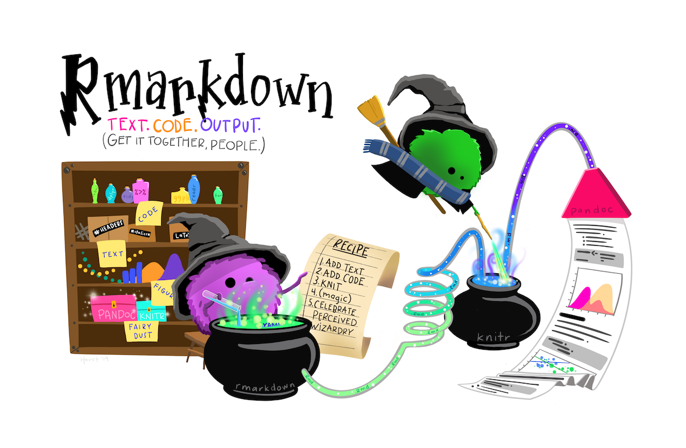

```{r, echo = FALSE, fig.align = 'center', fig.cap = "I'm far from being an expert but I have quite a bit of experience in code crashes."}

```


In this R Markdown file you will find the basic concepts to understand the core tidyverse collection of R packages. It is based on [tidyverse](https://www.tidyverse.org/) and [Jesse Mostipak's dplyr  tutorial](https://www.kaggle.com/jessemostipak/dive-into-dplyr-tutorial-1). I rearranged the information of these two files in a manner that I find the most interesting to understand the logic of tidyverse based on my own experience. Also, I add some comments and examples to understand it better. All credits deserves to the authors of the original documents.

# Tidyverse
```{r, echo = FALSE, fig.align = 'center', out.width = "30%"}
knitr::include_graphics('../02-figures/02-tidyverse-packages.png')
```
> The tidyverse is an opinionated collection of R packages designed for data science. All packages share an underlying design philosophy, grammar, and data structures.
> --- [tidyverse](https://www.tidyverse.org/)

```{r, echo = FALSE, fig.align = 'center', out.width = "30%", fig.cap = "by @allison_horst"}
knitr::include_graphics('../02-figures/03-dplyr.jpg')
```


```{r, echo = FALSE, fig.align = 'center', out.width = "30%", fig.cap = "by @allison_horst"}

```


```{r, eval = TRUE, include = FALSE}
# install.packages("tidyverse")
library(tidyverse)
```
<!--brief explanation of conflicts-->

+ Recommended book: [R for Data Science](https://r4ds.had.co.nz/) by Hadley Wickham & Garrett Grolemund

+ Core tidyverse packages:
  + [readr](https://readr.tidyverse.org/): read rectangular data
  + [dplyr](https://dplyr.tidyverse.org/): data manipulation
  + [tibble](https://tibble.tidyverse.org/): modern reimagining of the data.frame
  + [tidyr](https://tidyr.tidyverse.org/): tidy data
  + [purrr](https://purrr.tidyverse.org/): functional programming
  + [stringr](https://stringr.tidyverse.org/): string manipulation
  + [forcats](https://forcats.tidyverse.org/): solve problems with factors
  + [ggplot2](https://ggplot2.tidyverse.org/): data visualisation


## 1| readr (read rectangular data)
```{r, eval = TRUE, include = FALSE}
cars_df <- read_csv("../01-data/cars.csv")
```
<!--brief explanation of parsing-->

+ *few advantages compared to base R*
  + Use a consistent naming scheme for the parameters (e.g. col_names and col_types not header and colClasses).

  + Are much faster (up to 10x).

  + Leave strings as is by default, and automatically parse common date/time formats.

  + Have a helpful progress bar if loading is going to take a while.

```{r, eval = TRUE, include = FALSE}
# check out the data
glimpse(cars_df)
head(cars_df)
tail(cars_df)
summary(cars_df)
names(cars_df)
```


## 2| dplyr (data manipulation)
[A note by Roland Krasser](https://cran.r-project.org/web/packages/explore/vignettes/explore_mtcars.html): the data was extracted from the 1974 Motor Trend US magazine, and comprises fuel consumption and 10 aspects of automobile design and performance for 32 automobiles (1973–74 models).

+ Objective: select the best car brand (this example isn't real)
1. First I'll select those variable I understand 
2. Then I would filter those cars whose number of cylinders is greater than 4
3. Then arrange it in descending order
4. Finally show me the results
<!--brief explanation of pipes-->

```{r, eval = TRUE, include = FALSE}
cars_cyl <- cars_df %>% 
  select(-c(disp, hp, drat)) %>% 
  filter(cyl > 4) %>% 
  arrange(desc(cyl)) %>% 
  glimpse()

# or
cars_cyl_2 <- cars_df %>% 
  select(X1, cyl, mpg, everything()) %>% # reorder
  arrange(cyl) %>% # arrange in ascending order
  filter(X1 == "Mazda RX4") %>% # filter with character values
  glimpse()
```


5. Create a new variable (column) with mutate relating the number of cylinders & miles/(US) gallon
```{r, eval = TRUE, include = FALSE}
cars_cyl_mpg <- cars_cyl %>% 
  mutate(mpg_cyl = mpg * cyl) 
```

6. But wait! I'm just interested in the brand (Mercedes, Ferrari etc.) not in the model
```{r, eval = TRUE, include = FALSE}
cars_brand <- cars_cyl_mpg %>% 
  mutate(brand = stringr::word(X1, 1)) %>% # I introduce stringr
  summarise(mpg_cyl = mean(mpg_cyl)) # be careful with the NA's: na.rm = TRUE
```

7. But I didn't want that!
```{r, eval = TRUE, include = FALSE}
cars_brand_best <- cars_cyl_mpg %>%
  mutate(brand = stringr::word(X1, 1)) %>%
  group_by(brand) %>% # combined group_by: brand, gear
  summarise(mpg_cyl = mean(mpg_cyl)) %>% 
  arrange(desc(mpg_cyl)) %>% 
  glimpse()
```

8. Definitely Pontiac is the best brand!
9. So add the value, ranking position and medals of the top 3 car brands
```{r, eval = TRUE, echo = FALSE, warning = FALSE, message = FALSE}
rank_med <- tibble(ranking = c("1 position", "2 position",
                                "3 position"), medals = c("gold", "silver", "bronze"))

cars_brand_best %>% 
  slice(1:3) %>% 
  mutate(ranking = c("1 position", "2 position",
                                "3 position")) %>% 
  left_join(rank_med)
```

## 3| tibble (modern reimagining of the data.frame)
+ They do less than data.frames
+ They complain more than data.frames


## 4| tidyr (tidy data)
+ tidy data 3 characteristics:
1. Every column is variable
2. Every row is an observation
3. Every cell is a single value


## 5| purrr (functional programming)
Laura will explain next week ;)


## 6| stringr (string manipulation)
A cohesive set of functions designed to make working with strings as easy as possible


## 7| forcats (solve problems with factors)


## 8| ggplot (data visualisation)
ggplot2 is a system for declaratively creating graphics, based on The Grammar of Graphics. You provide the data, tell ggplot2 how to map variables to aesthetics, what graphical primitives to use, and it takes care of the details.


1. I create a tibble that contains productivity data in 3 consecutive years and the measurement site.
2. Tidy data
3. Visualise putting site 1 at the end (and using pipes)

```{r, eval = TRUE, echo = FALSE, fig.align = 'center', out.width = "50%"}
data_prod <- tibble( # introduce tibble
  productivity_1 = purrr::rdunif(10, 10, 100), # introduce purrr
  productivity_2 = rdunif(10, 10, 100),
  productivity_3 = rdunif(10, 10, 100), 
  sites = as.factor(seq(1 : 10))
)

data_prod_l <- data_prod %>% 
  pivot_longer( # introduce tidyr 
    cols = productivity_1 : productivity_3,
    names_to = "prod_year",
    values_to = "prod_value"
  ) %>%
  mutate(sites = fct_relevel(sites, "1", after = Inf)) # introduce forcats 

data_prod_l %>%
  ggplot(aes(x = prod_year, # introduce ggplot2 
                   y = prod_value,
                   color = sites)) +
  geom_point() + 
  scale_color_viridis_d() +
  scale_y_continuous(expand = c(0, 0)) +
  scale_x_discrete(labels = c("1", "2", "3")) +
  coord_cartesian(ylim = c(0, 120)) +
  ylab("Productivity") + 
  facet_grid(.~sites, switch = "x") +
  theme(legend.position = "none",
        axis.title = element_text(colour = "black", size = 12),
        axis.text = element_text(colour = "black", size = 12),
        axis.text.x = element_text(colour = "black", size = 12),
        axis.title.x = element_blank(),
        panel.grid.major = element_blank(), 
        panel.grid.minor = element_blank(),
        panel.background = element_blank(),
        axis.line = element_line(colour = "black", size = 0.5), 
        strip.background = element_blank(),
        strip.placement = "outside",
        strip.text.x = element_text(size = 12))
        
# remember the pipes ( %>% ) ?
tibble( # introduce tibble
  productivity_1 = purrr::rdunif(10, 10, 100), # introduce purrr
  productivity_2 = rdunif(10, 10, 100),
  productivity_3 = rdunif(10, 10, 100), 
  sites = as.factor(seq(1 : 10))
) %>% 
  pivot_longer( # introduce tidyr 
    cols = productivity_1 : productivity_3,
    names_to = "prod_year",
    values_to = "prod_value"
  ) %>%
  mutate(sites = fct_relevel(sites, "1", after = 3)) %>% # introduce forcats  
  ggplot(aes(x = prod_year, # introduce ggplot2 
                   y = prod_value,
                   color = sites)) +
  geom_point() + 
  scale_color_viridis_d() +
  scale_y_continuous(expand = c(0, 0)) +
  scale_x_discrete(labels = c("1", "2", "3")) +
  coord_cartesian(ylim = c(0, 120)) +
  ylab("Productivity") + 
  facet_grid(.~sites, switch = "x") +
  theme(legend.position = "none",
        axis.title = element_text(colour = "black", size = 12),
        axis.text = element_text(colour = "black", size = 12),
        axis.text.x = element_text(colour = "black", size = 12),
        axis.title.x = element_blank(),
        panel.grid.major = element_blank(), 
        panel.grid.minor = element_blank(),
        panel.background = element_blank(),
        axis.line = element_line(colour = "black", size = 0.5), 
        strip.background = element_blank(),
        strip.placement = "outside",
        strip.text.x = element_text(size = 12))

```


rmarkdown::render("03-rmd/intro_tidyverse-dplyr.Rmd", output_format = "all", output_dir = "04-doc")

