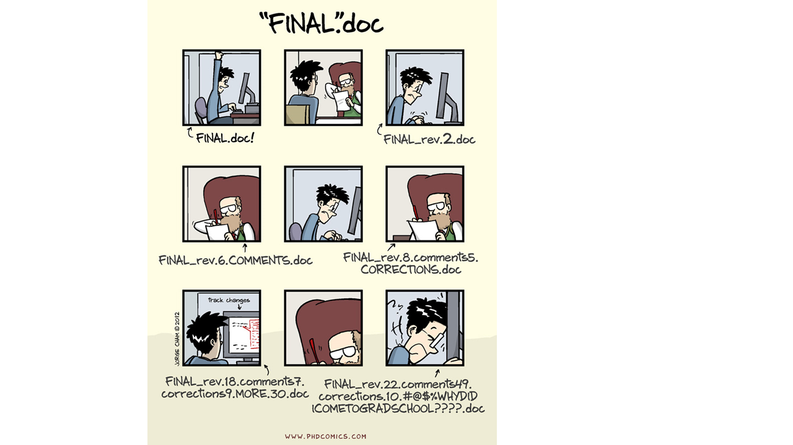

```{r setup, include = FALSE}

knitr::opts_chunk$set(echo = FALSE, eval = TRUE, warning = FALSE, message = FALSE, fig.width = 20, fig.height = 14, dpi = 600)
library(tidyverse)
library(here)
library(patchwork)
library(viridis)
library(ggpmisc)
library(gt)
library(fs)
# devtools::install_github("hadley/emo")
library(emo)

```

# Problem we are going to work with

In the city council of Alcalá de Henares there are still discrepancies about the existence of anthropogenic climate change. Some parties are of the opinion that it does not exist, others think that it exists but that it is not due to anthropogenic causes and others argue that all the scientific evidence leaves no doubt that it exists and that it is due to anthropogenic causes. The parties that believe that anthropogenic climate change exists have asked you, a group of experts, to produce a report that clearly shows how the increase in CO~2~ emissions has gone hand in hand with the increase in temperature in recent decades. How would you solve this issue?

# Climate & CO~2~ data

-   The data could be obtained, for example, from the following information sources: Climate data for Alcalá de Henares: <https://verughub.github.io/easyclimate/index.html>

-   CO~2~ emissions data for Spain: <https://edgar.jrc.ec.europa.eu/report_2020#data_download>

```{r download data}

## easyclimate

# remotes::install_github("VeruGHub/easyclimate")

library(easyclimate)

coords <- data.frame(
  lon = -3.35,
  lat = 40.48
)

# temp <- get_daily_climate(
#   coords,
#   period = 1950:2020, 
#   climatic_var = c("Tmin", "Tmax")
#   )

# save(temp, file = "00-raw/temp.RData")
# load(here("00-raw", "temp.RData"))

co_data <- read_csv(here("01-data", "co2.csv"))
temp <- read_delim(here("01-data", "temalcala.csv"), delim = ";")

# source(here("02-functions", "f_read_data.R"))
# 
# all_files <- read_all_csv(path = "01-data")

```

```{r tidy data}

co_data_l <- co_data %>% 
  pivot_longer(
    cols = "1970":"2019",
    names_to = "co_year",
    values_to = "co_value"
  )

co_data_l_sp <- co_data_l %>% 
  filter(country_name == "Spain and Andorra") %>% 
  select(!country_name)

temp_sel <- temp %>% 
  select(!c(ID_coords))

daily_tmean <- temp_sel %>%
  mutate(
    Tmean = (Tmin + Tmax) / 2,
    date = as.Date(date),
    month = format(date, format = "%m"),
    year = format(date, format = "%Y")
  )

yearly <- daily_tmean %>% 
  group_by(year) %>% 
  summarise(
    Tmean.year = mean(Tmean)
    )

co_temp <- full_join(
  co_data_l_sp, yearly, by = c("co_year" = "year")
)

co_temp_all <- co_temp %>% 
  mutate(
    co_value = as.numeric(co_value),
    co_year = as.numeric(co_year),
  ) %>% 
  group_by(co_year) %>% 
  summarise(
    co_all = sum(co_value),
    Tmean.year = first(Tmean.year)
  )

```

```{r data vis}

gg_ye_co <- ggplot(co_temp_all, aes(x = co_year, y = co_all,
                                    color = co_year
                                    )) +
  geom_line() +
  geom_smooth(method = "lm")

gg_ye_temp <- ggplot(co_temp_all, aes(x = co_year, y = Tmean.year,
                                      color = co_year
                                      )) +
  geom_point() +
  geom_smooth(method = "lm")

gg_co_temp <- ggplot(co_temp_all, aes(x = co_all, y = Tmean.year)) +
  geom_point() +
  geom_smooth(method = "lm")

co_temp <- co_temp %>% 
  mutate(
    co_value = as.numeric(co_value),
    co_year = as.numeric(co_year),
  )

gg_ye_co_sec <- co_temp %>% 
  drop_na(Sector) %>% 
  ggplot(aes(x = co_year, y = co_value, color = Sector)) +
  geom_line()

co_temp_fs <- co_temp %>% 
  mutate(
    # other = str_detect(Sector, "Other")
    Sector = fct_relevel(Sector, "Other industrial combustion", after = Inf),
    Sector = fct_relevel(Sector, "Other sectors", after = Inf)
    )

gg_ye_co_sec <- co_temp_fs %>% 
  drop_na(Sector) %>% 
  ggplot(aes(x = co_year, y = co_value, color = Sector)) +
  geom_line()

gg_theme <- function(gg, units, title){
  gg +
    geom_smooth(method = "lm", color = "firebrick", size = 1.3) +
    stat_fit_glance(
        method = "lm",
        label.x = "left",
        label.y = "top",
        method.args = list(formula = y ~ x),
        mapping = aes(
          label = sprintf('italic(R^2)~"="~%.3f~~italic(P)~"="~%.2g',
                          after_stat(r.squared), after_stat(p.value))
        ),
        parse = TRUE
      ) +
    geom_point(alpha = .5) +
    scale_y_continuous(labels = function(x){paste0(x, units)}) +
    scale_color_viridis_c(option = "turbo", direction = -1, name = NULL,
                          breaks = seq(1950, 2020, 10)) +
    guides(color = guide_colorsteps(barwidth = unit(30, "lines"),
                                    barheight = unit(.4, "lines"))) +
    labs(y = NULL, x = NULL,
         title = title) +
    theme(
      panel.grid.major = element_line(colour = "grey90", size = 0.5),
      panel.background = element_blank(),
      panel.grid.minor = element_blank(),
      legend.position = "top",
      legend.title = element_text(size = 14, color = "grey20"),
      legend.text = element_text(size = 12, color = "grey50"),
      plot.title = element_text(size = 22, margin = margin(b = 15)),
      plot.subtitle = element_text(size = 14, margin = margin(b = 15)),
      plot.caption = element_text(size = 14, color = "grey50", margin = margin(t = 25)),
      plot.title.position = "plot",
      plot.caption.position = "plot",
      axis.text = element_text(size = 14),
      axis.line.x = element_line(color = "grey20"),
      axis.ticks.x = element_line(color = "grey20"),
      plot.margin = margin(20, 20, 10, 20)
      )
}

arg_3 <- list(
  gg =list(gg_ye_co, gg_ye_temp, gg_co_temp),
  units = c("°C", "Mt CO2/yr", "°C"),
  title = c(
    "Annual mean temperature",
    "Annual CO2 emissions",
    "Annual mean temperature vs Annual CO2 emissions"
  )
  )

purrr_plots <- arg_3 %>% 
  pmap(gg_theme) %>% 
  reduce(`/`)

gg_ye_co_sec_th <- gg_ye_co_sec +
    geom_point(alpha = .5) +
    scale_y_continuous(labels = function(x){paste0(x, " Mt CO2/yr")}) +
    labs(y = NULL, x = NULL,
         title = bquote(Annual~CO[2]~emissions~by~sectors)) +
    theme(
      panel.grid.major = element_line(colour = "grey90", size = 0.5),
      panel.background = element_blank(),
      panel.grid.minor = element_blank(),
      legend.key = element_blank(),
      legend.position = "top",
      legend.title = element_text(size = 14, color = "grey20"),
      legend.text = element_text(size = 12, color = "grey50"),
      plot.title = element_text(size = 22, margin = margin(b = 15)),
      plot.subtitle = element_text(size = 14, margin = margin(b = 15)),
      plot.caption = element_text(size = 14, color = "grey50", margin = margin(t = 25)),
      plot.title.position = "plot",
      plot.caption.position = "plot",
      axis.text = element_text(size = 14),
      axis.line.x = element_line(color = "grey20"),
      axis.ticks.x = element_line(color = "grey20"),
      plot.margin = margin(20, 20, 10, 20)
      )

final_plot <- (purrr_plots[[1]] + gg_ye_co_sec_th) /
  (purrr_plots[[2]] + purrr_plots[[3]]) +
  plot_annotation(
    title = expression(paste("Annual mean temperature and "~CO[2], " emissions relationship over the years in Alcalá de Henares, Madrid (1950-2020)")),
    caption = "   Data source:
      -Moreno A, Hasenauer H (2016). “Spatial downscaling of European climate data” International Journal of Climatology, 1444–1458.
      -Rammer W, Pucher C, Neumann M (2018). Description, Evaluation and Validation of Downscaled Daily Climate Data Version 2.
      -Cruz-Alonso V, Rodríguez-Sánchez F, Pucher C, Ratcliffe S, Astigarraga J, Neumann M, Ruiz-Benito P (2021). easyclimate: Easy access to high-resolution daily climate data for Europe.
      -Crippa M, Guizzardi D, Muntean M, Schaaf E, Solazzo E, Monforti-Ferrario F, Olivier JGJ, Vignati E, Fossil CO2 emissions of all world countries - 2020 Report, EUR 30358 EN,
       Publications Office of the European Union, Luxembourg, 2020.
    Graphic: Students and teachers of **Ciencia de Datos Práctica: Resolución de Problemas Ambientales Mediante Proyectos (Universidad de Alcalá)** course",
    theme = theme(
      plot.title = element_text(size = 24, face = "bold"),
      plot.caption = element_text(hjust = 0, size = 14, color = "grey50", margin = margin(t = 25))
      )
    )

final_plot

ggsave(
  file = here("03-figures", "tidy.png"),
  width = 20,
  height = 14
)

```

# Main results

The correlation between warming and CO~2~ increase is of `r round(cor(co_temp_all$co_all, co_temp_all$Tmean.year, use = "complete.obs"), 2)`. Thus, in agreement with @ipcc2021 we found that there is no doubt that climate change exists and that humans are the main cause of it.

::: {custom-style="align_right"}
Ciencia de Datos Práctica: Resolución de Problemas Ambientales Mediante Proyectos (Universidad de Alcalá)
:::

# References

::: {#refs}
:::

# Appendix

# Appendix 1. Data used

**Table A1.** An example of a table using annual CO~2~ emissions and mean temperature data

```{r table}

# https://gt.rstudio.com/
# https://ardata-fr.github.io/flextable-book/

table_A1 <- co_temp_all %>% 
  gt(rowname_col = "co_year") %>%
  fmt_number(
    columns = c(co_all, Tmean.year),
    decimals = 1
  ) %>% 
  cols_label(
    co_year = "Evolutionary history (°C)",
    co_all = "CO2 emissions (Mt CO2/yr)",
    Tmean.year = "Mean temperature"
  ) %>% 
  tab_style(
    style = list(
      cell_text(weight = "bold")
    ),
    locations = list(
      cells_column_labels(gt::everything())
    )
  )  %>%
  cols_align(
    align = "center",
    columns = gt::everything()
  )

gtsave(table_A1, "table_A1.rtf", path = here("05-doc"))

```

# Appendix 2. R Markdown

-   R Markdown (<https://rmarkdown.rstudio.com>)

-   Git (<https://git-scm.com/>)

-   GitHub (<https://github.com/>)

-   Problemas comunes:

    \- Sobreescritura de un archivo

    \- Versiones finales infinitas

    \

    \- Trabajo por error en una versión que no era la final

    \- Creación de copias "en conflicto" cuando dos personas trabajan a la vez

    \- Ediciones sin control de cambios

## [Qué es R Markdown](https://rmarkdown.rstudio.com)

-   R Markdown es un formato de archivo para crear documentos dinámicos con R

-   Escrito en markdown y contiene partes de código de R (o algún otro lenguaje de programación) integrado

-   Fue diseñado para facilitar la reproducibilidad

-   Se apoya en knitr (<https://yihui.org/knitr/>) y Pandoc (<https://pandoc.org/>)

-   Otras razones para trabajar en R Markdown: aumento de la eficiencia de trabajo (a medio-largo plazo), producción de documentos de alta calidad, etc.

## Fundamentos básicos de R Markdown

Para crear un archivo R Markdown: File -> New File -> R Markdown. Estos archivos tienen 3 componentes principales: (i) metadatos, (ii) texto, (iii) código

-   Metadatos: se escribe entre `` `---` `` (al comienzo del archivo). Utiliza la sintaxis de [YAML](https://en.wikipedia.org/wiki/YAML). La sangría es importante!

-   Texto: sintaxis Markdown

-   2 tipos de código:

    -   Code chunk (trozo de código): se escribe entre ```` ```{r}``` ````; `r` indica el lenguaje (atajo: `Ctrl + Alt + I`)

    -   Inline (en línea): se escribe entre `` `r` ``

Para compilar un archivo R Markdown se utiliza el botón de "*Knit*" de RStudio (atajo: `Ctrl + Shift + K`). También se puede hacer mediante código: rmarkdown::render("intro_repro.Rmd", output_dir = "output")

Para buscar ayuda: Help -> Markdown Quick Reference (italics, bold, headers, lists, links, images, R codes, tables, page break, superscripts...)

**negrita**, *cursiva*, subíndice~1~, superíndice^2^, codes, [hypervínculo](https://bookdown.org/yihui/rmarkdown/markdown-syntax.html), notas al pie[^1]

[^1]: hello world

Títulos (\# primer nivel; ## segundo nivel...), listas y sublistas (\*, -, +),

> "R Markdown es maravilloso"
>
> --- Julen Astigarraga

$f(how) = {do \choose you} feel^{excellent} (1-p)^{n-k}$

<!--# esto es un comentario -->

`r emo::ji("voltage")` Cambia al **Visual markdown editing mode** mediante el botón del compás

Para analizar las múltiples opciones de chunk (`Ctrl + Alt + I`): (<https://bookdown.org/yihui/rmarkdown/r-code.html>)

[Formatos de salida](https://bookdown.org/yihui/rmarkdown/output-formats.html)

-   [documento word](https://bookdown.org/yihui/rmarkdown/word-document.html)

-   [documento pdf](https://bookdown.org/yihui/rmarkdown/pdf-document.html):

    -   [TinyTeX](https://yihui.name/tinytex/) (for R users who have not installed LaTeX before)

## Para más información

-   [R Markdown: The Definitive Guide](https://bookdown.org/yihui/rmarkdown/)

-   [RStudio Cheat Sheets](https://rstudio.com/resources/cheatsheets/)
