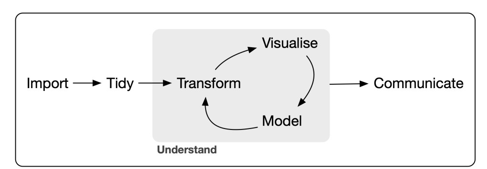
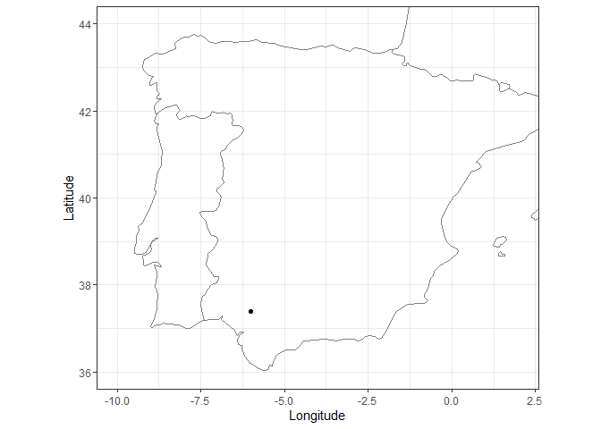
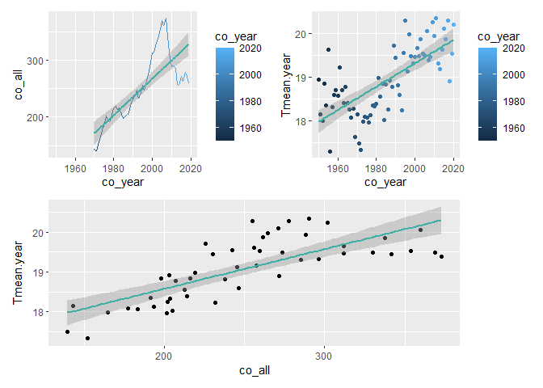
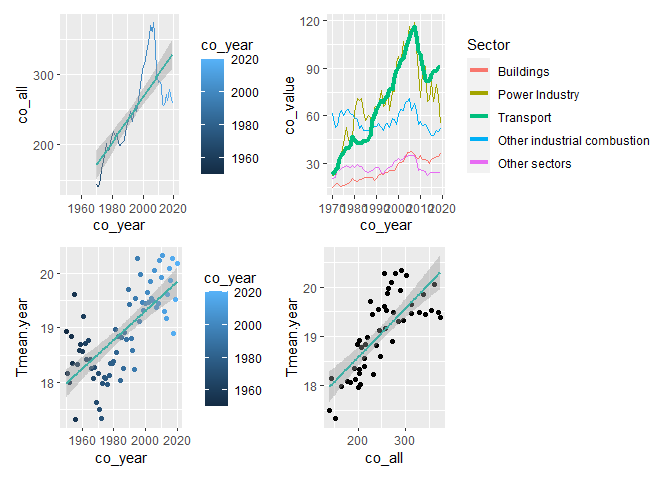
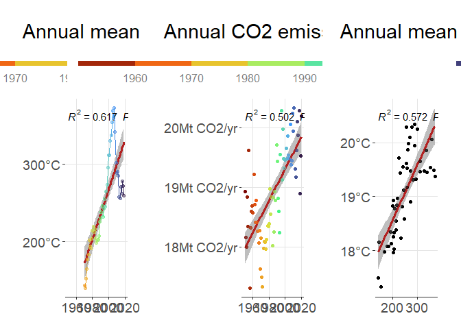

<div class="figure" style="text-align: center">

<p class="caption">Illustrations from Allison Horst</p>
</div>

In this R Markdown file you will find the basic concepts to understand the core tidyverse collection of R packages (<https://www.tidyverse.org/>)

# Problem we are going to work with

In the city council of Sevilla there are still discrepancies about the existence of anthropogenic climate change. Some parties are of the opinion that it does not exist, others think that it exists but that it is not due to anthropogenic causes and others argue that all the scientific evidence leaves no doubt that it exists and that it is due to anthropogenic causes. The parties that believe that anthropogenic climate change exists have asked you, a group of experts, to produce a report that clearly shows how the increase in CO~2~ emissions has gone hand in hand with the increase in temperature in recent decades. How would you solve this issue?

-   The data could be obtained, for example, from the following information sources: Climate data for Sevilla: <https://verughub.github.io/easyclimate/index.html>

-   CO~2~ emissions data for Spain: <https://edgar.jrc.ec.europa.eu/report_2020#data_download>

<div class="figure" style="text-align: center">

<p class="caption">Wickham & Grolemund (2017)</p>
</div>

## Download data


```r
coords <- data.frame(
  lon = -5.99629,
  lat = 37.3826
)

ggplot() +
  borders(regions = c("Spain", "Portugal", "France")) +
  geom_point(data = coords, aes(x = lon, y = lat)) +
  coord_fixed(xlim = c(-10, 2), ylim = c(36, 44), ratio = 1.3) +
  xlab("Longitude") +
  ylab("Latitude") +
  theme_bw()
```

<!-- -->

```r
# tmin <- get_daily_climate(
#   coords,
#   period = 1950:2020,
#   climatic_var = "Tmin"
#   )
# 
# tmax <- get_daily_climate(
#   coords,
#   period = 1950:2020,
#   climatic_var = "Tmax"
#   )

# write_rds(tmin, file = here("00-raw", "tmin_sevilla.rds"))
# write_rds(tmax, file = here("00-raw", "tmax_sevilla.rds"))
```

# The Tidyverse


> The tidyverse is an opinionated collection of R packages designed for data science. All packages share an underlying design philosophy, grammar, and data structures. --- [tidyverse](https://www.tidyverse.org/)

> The tidyverse is fundamentally human centred (Wickham et al. JOSS, 2019) ---

📝 *few advantages compared to base R*

## 1\| readr (read rectangular data)

-   📝 Use a consistent naming scheme for the parameters (e.g. col_names and col_types not header and colClasses)
-   Are much faster (up to 10x)

1.  Read CO~2~ and temperature data


```r
co_data <- read_csv(here("02-data", "co2.csv"))
tmin_data <- read_rds(file = here("02-data", "tmin_sevilla.rds"))
tmax_data <- read_rds(file = here("02-data", "tmax_sevilla.rds"))
```


```r
glimpse(co_data)
```

```
## Rows: 1,036
## Columns: 52
## $ Sector       <chr> "Buildings", "Buildings", "Buildings", "Buildings", "Buil…
## $ country_name <chr> "Afghanistan", "Albania", "Algeria", "Angola", "Anguilla"…
## $ `1970`       <chr> "0.58", "0.99", "1.81", "0.12", "0.00", "0.06", "13.19", …
## $ `1971`       <chr> "0.58", "0.99", "1.81", "0.12", "0.00", "0.06", "13.19", …
## $ `1972`       <chr> "0.46", "1.10", "2.11", "0.14", "0.00", "0.08", "12.53", …
## $ `1973`       <chr> "0.57", "1.30", "2.51", "0.14", "0.00", "0.08", "15.03", …
## $ `1974`       <chr> "0.77", "1.41", "2.68", "0.13", "0.00", "0.06", "15.48", …
## $ `1975`       <chr> "0.59", "1.75", "2.97", "0.12", "0.00", "0.08", "16.22", …
## $ `1976`       <chr> "0.48", "1.91", "3.79", "0.09", "0.00", "0.06", "17.57", …
## $ `1977`       <chr> "0.43", "2.02", "3.80", "0.10", "0.00", "0.07", "18.60", …
## $ `1978`       <chr> "0.41", "2.21", "4.46", "0.33", "0.00", "0.06", "18.27", …
## $ `1979`       <chr> "0.48", "2.69", "5.16", "0.56", "0.00", "0.06", "18.80", …
## $ `1980`       <chr> "0.45", "1.73", "5.37", "0.70", "0.00", "0.06", "18.40", …
## $ `1981`       <chr> "0.52", "1.81", "5.84", "0.66", "0.00", "0.06", "19.40", …
## $ `1982`       <chr> "0.60", "1.90", "6.24", "0.38", "0.00", "0.07", "18.64", …
## $ `1983`       <chr> "0.94", "2.01", "7.04", "0.50", "0.00", "0.04", "20.14", …
## $ `1984`       <chr> "0.99", "2.06", "7.76", "0.55", "0.00", "0.06", "20.54", …
## $ `1985`       <chr> "1.28", "2.09", "4.87", "0.60", "0.00", "0.06", "20.83", …
## $ `1986`       <chr> "1.20", "2.20", "5.60", "0.62", "0.00", "0.07", "20.21", …
## $ `1987`       <chr> "0.79", "2.20", "6.01", "0.63", "0.00", "0.08", "21.72", …
## $ `1988`       <chr> "0.85", "2.33", "6.03", "0.75", "0.00", "0.08", "22.63", …
## $ `1989`       <chr> "0.98", "1.53", "6.76", "0.73", "0.00", "0.09", "21.19", …
## $ `1990`       <chr> "1.04", "2.09", "6.59", "0.66", "0.00", "0.09", "22.01", …
## $ `1991`       <chr> "0.99", "1.32", "7.54", "0.69", "0.00", "0.09", "22.12", …
## $ `1992`       <chr> "0.69", "0.57", "7.78", "0.62", "0.00", "0.08", "22.23", …
## $ `1993`       <chr> "0.60", "0.39", "8.23", "0.51", "0.00", "0.07", "22.98", …
## $ `1994`       <chr> "0.63", "0.33", "8.17", "0.63", "0.00", "0.08", "24.08", …
## $ `1995`       <chr> "0.36", "0.33", "8.09", "0.67", "0.00", "0.08", "24.72", …
## $ `1996`       <chr> "0.33", "0.45", "8.31", "0.91", "0.00", "0.08", "25.29", …
## $ `1997`       <chr> "0.36", "0.38", "7.98", "0.91", "0.00", "0.08", "24.76", …
## $ `1998`       <chr> "0.29", "0.29", "8.63", "1.01", "0.00", "0.04", "24.79", …
## $ `1999`       <chr> "0.29", "0.75", "9.09", "1.26", "0.00", "0.06", "26.32", …
## $ `2000`       <chr> "0.21", "0.76", "9.33", "1.05", "0.00", "0.05", "27.00", …
## $ `2001`       <chr> "0.12", "0.80", "9.53", "1.17", "0.00", "0.04", "25.70", …
## $ `2002`       <chr> "0.05", "1.17", "9.89", "1.20", "0.00", "0.05", "24.73", …
## $ `2003`       <chr> "0.03", "1.04", "10.68", "1.26", "0.00", "0.05", "26.97",…
## $ `2004`       <chr> "0.04", "0.88", "11.51", "1.30", "0.00", "0.04", "29.54",…
## $ `2005`       <chr> "0.08", "0.70", "12.50", "1.00", "0.00", "0.04", "31.25",…
## $ `2006`       <chr> "0.11", "0.93", "12.19", "1.96", "0.00", "0.04", "32.83",…
## $ `2007`       <chr> "0.16", "0.72", "13.60", "2.33", "0.00", "0.04", "33.16",…
## $ `2008`       <chr> "0.32", "0.65", "13.57", "2.97", "0.00", "0.03", "37.37",…
## $ `2009`       <chr> "0.47", "0.55", "17.40", "3.51", "0.00", "0.04", "36.48",…
## $ `2010`       <chr> "0.65", "0.56", "16.80", "3.77", "0.00", "0.05", "36.48",…
## $ `2011`       <chr> "0.75", "0.56", "18.57", "4.15", "0.00", "0.04", "33.71",…
## $ `2012`       <chr> "0.75", "0.49", "20.33", "4.61", "0.00", "0.06", "35.48",…
## $ `2013`       <chr> "0.92", "0.56", "22.60", "5.69", "0.00", "0.10", "37.59",…
## $ `2014`       <chr> "0.85", "0.62", "21.57", "5.61", "0.00", "0.07", "38.62",…
## $ `2015`       <chr> "0.86", "0.63", "23.51", "5.06", "0.00", "0.08", "39.36",…
## $ `2016`       <chr> "0.80", "0.62", "23.19", "5.03", "0.00", "0.08", "39.71",…
## $ `2017`       <chr> "0.84", "0.70", "23.91", "4.14", "0.00", "0.06", "38.31",…
## $ `2018`       <chr> "0.86781928", "0.70320991", "25.8825776", "4.191584", "1.…
## $ `2019`       <chr> "0.89489653", "0.71658967", "27.0897153", "4.2916661", "1…
```

```r
head(co_data)
```

```
## # A tibble: 6 × 52
##   Sector    country_name `1970` `1971` `1972` `1973` `1974` `1975` `1976` `1977`
##   <chr>     <chr>        <chr>  <chr>  <chr>  <chr>  <chr>  <chr>  <chr>  <chr> 
## 1 Buildings Afghanistan  0.58   0.58   0.46   0.57   0.77   0.59   0.48   0.43  
## 2 Buildings Albania      0.99   0.99   1.10   1.30   1.41   1.75   1.91   2.02  
## 3 Buildings Algeria      1.81   1.81   2.11   2.51   2.68   2.97   3.79   3.80  
## 4 Buildings Angola       0.12   0.12   0.14   0.14   0.13   0.12   0.09   0.10  
## 5 Buildings Anguilla     0.00   0.00   0.00   0.00   0.00   0.00   0.00   0.00  
## 6 Buildings Antigua and… 0.06   0.06   0.08   0.08   0.06   0.08   0.06   0.07  
## # … with 42 more variables: `1978` <chr>, `1979` <chr>, `1980` <chr>,
## #   `1981` <chr>, `1982` <chr>, `1983` <chr>, `1984` <chr>, `1985` <chr>,
## #   `1986` <chr>, `1987` <chr>, `1988` <chr>, `1989` <chr>, `1990` <chr>,
## #   `1991` <chr>, `1992` <chr>, `1993` <chr>, `1994` <chr>, `1995` <chr>,
## #   `1996` <chr>, `1997` <chr>, `1998` <chr>, `1999` <chr>, `2000` <chr>,
## #   `2001` <chr>, `2002` <chr>, `2003` <chr>, `2004` <chr>, `2005` <chr>,
## #   `2006` <chr>, `2007` <chr>, `2008` <chr>, `2009` <chr>, `2010` <chr>, …
```

```r
tail(co_data)
```

```
## # A tibble: 6 × 52
##   Sector    country_name `1970` `1971` `1972` `1973` `1974` `1975` `1976` `1977`
##   <chr>     <chr>        <chr>  <chr>  <chr>  <chr>  <chr>  <chr>  <chr>  <chr> 
## 1 Transport Western Sah… 0.01   0.01   0.01   0.01   0.01   0.01   0.02   0.02  
## 2 Transport Yemen        0.66   0.66   0.92   1.25   1.25   1.02   1.53   1.47  
## 3 Transport Zambia       0.63   0.63   0.69   0.73   0.69   0.74   0.77   0.68  
## 4 Transport Zimbabwe     2.08   2.08   2.28   2.28   1.93   2.15   1.86   1.73  
## 5 Transport Internation… 168.82 168.82 178.76 186.62 179.14 173.24 173.69 189.34
## 6 Transport Internation… 353.86 353.86 370.88 391.73 366.05 341.22 352.02 351.74
## # … with 42 more variables: `1978` <chr>, `1979` <chr>, `1980` <chr>,
## #   `1981` <chr>, `1982` <chr>, `1983` <chr>, `1984` <chr>, `1985` <chr>,
## #   `1986` <chr>, `1987` <chr>, `1988` <chr>, `1989` <chr>, `1990` <chr>,
## #   `1991` <chr>, `1992` <chr>, `1993` <chr>, `1994` <chr>, `1995` <chr>,
## #   `1996` <chr>, `1997` <chr>, `1998` <chr>, `1999` <chr>, `2000` <chr>,
## #   `2001` <chr>, `2002` <chr>, `2003` <chr>, `2004` <chr>, `2005` <chr>,
## #   `2006` <chr>, `2007` <chr>, `2008` <chr>, `2009` <chr>, `2010` <chr>, …
```

```r
summary(co_data)
```

```
##     Sector          country_name           1970               1971          
##  Length:1036        Length:1036        Length:1036        Length:1036       
##  Class :character   Class :character   Class :character   Class :character  
##  Mode  :character   Mode  :character   Mode  :character   Mode  :character  
##      1972               1973               1974               1975          
##  Length:1036        Length:1036        Length:1036        Length:1036       
##  Class :character   Class :character   Class :character   Class :character  
##  Mode  :character   Mode  :character   Mode  :character   Mode  :character  
##      1976               1977               1978               1979          
##  Length:1036        Length:1036        Length:1036        Length:1036       
##  Class :character   Class :character   Class :character   Class :character  
##  Mode  :character   Mode  :character   Mode  :character   Mode  :character  
##      1980               1981               1982               1983          
##  Length:1036        Length:1036        Length:1036        Length:1036       
##  Class :character   Class :character   Class :character   Class :character  
##  Mode  :character   Mode  :character   Mode  :character   Mode  :character  
##      1984               1985               1986               1987          
##  Length:1036        Length:1036        Length:1036        Length:1036       
##  Class :character   Class :character   Class :character   Class :character  
##  Mode  :character   Mode  :character   Mode  :character   Mode  :character  
##      1988               1989               1990               1991          
##  Length:1036        Length:1036        Length:1036        Length:1036       
##  Class :character   Class :character   Class :character   Class :character  
##  Mode  :character   Mode  :character   Mode  :character   Mode  :character  
##      1992               1993               1994               1995          
##  Length:1036        Length:1036        Length:1036        Length:1036       
##  Class :character   Class :character   Class :character   Class :character  
##  Mode  :character   Mode  :character   Mode  :character   Mode  :character  
##      1996               1997               1998               1999          
##  Length:1036        Length:1036        Length:1036        Length:1036       
##  Class :character   Class :character   Class :character   Class :character  
##  Mode  :character   Mode  :character   Mode  :character   Mode  :character  
##      2000               2001               2002               2003          
##  Length:1036        Length:1036        Length:1036        Length:1036       
##  Class :character   Class :character   Class :character   Class :character  
##  Mode  :character   Mode  :character   Mode  :character   Mode  :character  
##      2004               2005               2006               2007          
##  Length:1036        Length:1036        Length:1036        Length:1036       
##  Class :character   Class :character   Class :character   Class :character  
##  Mode  :character   Mode  :character   Mode  :character   Mode  :character  
##      2008               2009               2010               2011          
##  Length:1036        Length:1036        Length:1036        Length:1036       
##  Class :character   Class :character   Class :character   Class :character  
##  Mode  :character   Mode  :character   Mode  :character   Mode  :character  
##      2012               2013               2014               2015          
##  Length:1036        Length:1036        Length:1036        Length:1036       
##  Class :character   Class :character   Class :character   Class :character  
##  Mode  :character   Mode  :character   Mode  :character   Mode  :character  
##      2016               2017               2018               2019          
##  Length:1036        Length:1036        Length:1036        Length:1036       
##  Class :character   Class :character   Class :character   Class :character  
##  Mode  :character   Mode  :character   Mode  :character   Mode  :character
```

```r
names(co_data)
```

```
##  [1] "Sector"       "country_name" "1970"         "1971"         "1972"        
##  [6] "1973"         "1974"         "1975"         "1976"         "1977"        
## [11] "1978"         "1979"         "1980"         "1981"         "1982"        
## [16] "1983"         "1984"         "1985"         "1986"         "1987"        
## [21] "1988"         "1989"         "1990"         "1991"         "1992"        
## [26] "1993"         "1994"         "1995"         "1996"         "1997"        
## [31] "1998"         "1999"         "2000"         "2001"         "2002"        
## [36] "2003"         "2004"         "2005"         "2006"         "2007"        
## [41] "2008"         "2009"         "2010"         "2011"         "2012"        
## [46] "2013"         "2014"         "2015"         "2016"         "2017"        
## [51] "2018"         "2019"
```

```r
glimpse(tmin_data)
```

```
## Rows: 25,933
## Columns: 5
## $ ID_coords <int> 1, 1, 1, 1, 1, 1, 1, 1, 1, 1, 1, 1, 1, 1, 1, 1, 1, 1, 1, 1, …
## $ lon       <dbl> -5.99629, -5.99629, -5.99629, -5.99629, -5.99629, -5.99629, …
## $ lat       <dbl> 37.3826, 37.3826, 37.3826, 37.3826, 37.3826, 37.3826, 37.382…
## $ date      <chr> "1950-01-01", "1950-01-02", "1950-01-03", "1950-01-04", "195…
## $ Tmin      <dbl> 6.74, 6.46, 5.46, 3.76, 4.65, 6.57, 5.64, 6.93, 7.68, 4.71, …
```

```r
glimpse(tmax_data)
```

```
## Rows: 25,933
## Columns: 5
## $ ID_coords <int> 1, 1, 1, 1, 1, 1, 1, 1, 1, 1, 1, 1, 1, 1, 1, 1, 1, 1, 1, 1, …
## $ lon       <dbl> -5.99629, -5.99629, -5.99629, -5.99629, -5.99629, -5.99629, …
## $ lat       <dbl> 37.3826, 37.3826, 37.3826, 37.3826, 37.3826, 37.3826, 37.382…
## $ date      <chr> "1950-01-01", "1950-01-02", "1950-01-03", "1950-01-04", "195…
## $ Tmax      <dbl> 16.84, 16.99, 15.95, 18.68, 18.41, 15.73, 12.32, 16.06, 16.5…
```

## 2\| tibble (modern reimagining of the data.frame)

-   📝 Allow to work with list-columns
-   Assists the user in displaying the printing
-   Never do partial matching


```r
class(co_data)
```

```
## [1] "spec_tbl_df" "tbl_df"      "tbl"         "data.frame"
```

```r
co_data_df <- as.data.frame(co_data)
co_data <- as_tibble(co_data)

co_data_df$Secto
```

```
##    [1] "Buildings"                   "Buildings"                  
##    [3] "Buildings"                   "Buildings"                  
##    [5] "Buildings"                   "Buildings"                  
##    [7] "Buildings"                   "Buildings"                  
##    [9] "Buildings"                   "Buildings"                  
##   [11] "Buildings"                   "Buildings"                  
##   [13] "Buildings"                   "Buildings"                  
##   [15] "Buildings"                   "Buildings"                  
##   [17] "Buildings"                   "Buildings"                  
##   [19] "Buildings"                   "Buildings"                  
##   [21] "Buildings"                   "Buildings"                  
##   [23] "Buildings"                   "Buildings"                  
##   [25] "Buildings"                   "Buildings"                  
##   [27] "Buildings"                   "Buildings"                  
##   [29] "Buildings"                   "Buildings"                  
##   [31] "Buildings"                   "Buildings"                  
##   [33] "Buildings"                   "Buildings"                  
##   [35] "Buildings"                   "Buildings"                  
##   [37] "Buildings"                   "Buildings"                  
##   [39] "Buildings"                   "Buildings"                  
##   [41] "Buildings"                   "Buildings"                  
##   [43] "Buildings"                   "Buildings"                  
##   [45] "Buildings"                   "Buildings"                  
##   [47] "Buildings"                   "Buildings"                  
##   [49] "Buildings"                   "Buildings"                  
##   [51] "Buildings"                   "Buildings"                  
##   [53] "Buildings"                   "Buildings"                  
##   [55] "Buildings"                   "Buildings"                  
##   [57] "Buildings"                   "Buildings"                  
##   [59] "Buildings"                   "Buildings"                  
##   [61] "Buildings"                   "Buildings"                  
##   [63] "Buildings"                   "Buildings"                  
##   [65] "Buildings"                   "Buildings"                  
##   [67] "Buildings"                   "Buildings"                  
##   [69] "Buildings"                   "Buildings"                  
##   [71] "Buildings"                   "Buildings"                  
##   [73] "Buildings"                   "Buildings"                  
##   [75] "Buildings"                   "Buildings"                  
##   [77] "Buildings"                   "Buildings"                  
##   [79] "Buildings"                   "Buildings"                  
##   [81] "Buildings"                   "Buildings"                  
##   [83] "Buildings"                   "Buildings"                  
##   [85] "Buildings"                   "Buildings"                  
##   [87] "Buildings"                   "Buildings"                  
##   [89] "Buildings"                   "Buildings"                  
##   [91] "Buildings"                   "Buildings"                  
##   [93] "Buildings"                   "Buildings"                  
##   [95] "Buildings"                   "Buildings"                  
##   [97] "Buildings"                   "Buildings"                  
##   [99] "Buildings"                   "Buildings"                  
##  [101] "Buildings"                   "Buildings"                  
##  [103] "Buildings"                   "Buildings"                  
##  [105] "Buildings"                   "Buildings"                  
##  [107] "Buildings"                   "Buildings"                  
##  [109] "Buildings"                   "Buildings"                  
##  [111] "Buildings"                   "Buildings"                  
##  [113] "Buildings"                   "Buildings"                  
##  [115] "Buildings"                   "Buildings"                  
##  [117] "Buildings"                   "Buildings"                  
##  [119] "Buildings"                   "Buildings"                  
##  [121] "Buildings"                   "Buildings"                  
##  [123] "Buildings"                   "Buildings"                  
##  [125] "Buildings"                   "Buildings"                  
##  [127] "Buildings"                   "Buildings"                  
##  [129] "Buildings"                   "Buildings"                  
##  [131] "Buildings"                   "Buildings"                  
##  [133] "Buildings"                   "Buildings"                  
##  [135] "Buildings"                   "Buildings"                  
##  [137] "Buildings"                   "Buildings"                  
##  [139] "Buildings"                   "Buildings"                  
##  [141] "Buildings"                   "Buildings"                  
##  [143] "Buildings"                   "Buildings"                  
##  [145] "Buildings"                   "Buildings"                  
##  [147] "Buildings"                   "Buildings"                  
##  [149] "Buildings"                   "Buildings"                  
##  [151] "Buildings"                   "Buildings"                  
##  [153] "Buildings"                   "Buildings"                  
##  [155] "Buildings"                   "Buildings"                  
##  [157] "Buildings"                   "Buildings"                  
##  [159] "Buildings"                   "Buildings"                  
##  [161] "Buildings"                   "Buildings"                  
##  [163] "Buildings"                   "Buildings"                  
##  [165] "Buildings"                   "Buildings"                  
##  [167] "Buildings"                   "Buildings"                  
##  [169] "Buildings"                   "Buildings"                  
##  [171] "Buildings"                   "Buildings"                  
##  [173] "Buildings"                   "Buildings"                  
##  [175] "Buildings"                   "Buildings"                  
##  [177] "Buildings"                   "Buildings"                  
##  [179] "Buildings"                   "Buildings"                  
##  [181] "Buildings"                   "Buildings"                  
##  [183] "Buildings"                   "Buildings"                  
##  [185] "Buildings"                   "Buildings"                  
##  [187] "Buildings"                   "Buildings"                  
##  [189] "Buildings"                   "Buildings"                  
##  [191] "Buildings"                   "Buildings"                  
##  [193] "Buildings"                   "Buildings"                  
##  [195] "Buildings"                   "Buildings"                  
##  [197] "Buildings"                   "Buildings"                  
##  [199] "Buildings"                   "Buildings"                  
##  [201] "Buildings"                   "Buildings"                  
##  [203] "Buildings"                   "Buildings"                  
##  [205] "Buildings"                   "Buildings"                  
##  [207] "Other sectors"               "Other sectors"              
##  [209] "Other sectors"               "Other sectors"              
##  [211] "Other sectors"               "Other sectors"              
##  [213] "Other sectors"               "Other sectors"              
##  [215] "Other sectors"               "Other sectors"              
##  [217] "Other sectors"               "Other sectors"              
##  [219] "Other sectors"               "Other sectors"              
##  [221] "Other sectors"               "Other sectors"              
##  [223] "Other sectors"               "Other sectors"              
##  [225] "Other sectors"               "Other sectors"              
##  [227] "Other sectors"               "Other sectors"              
##  [229] "Other sectors"               "Other sectors"              
##  [231] "Other sectors"               "Other sectors"              
##  [233] "Other sectors"               "Other sectors"              
##  [235] "Other sectors"               "Other sectors"              
##  [237] "Other sectors"               "Other sectors"              
##  [239] "Other sectors"               "Other sectors"              
##  [241] "Other sectors"               "Other sectors"              
##  [243] "Other sectors"               "Other sectors"              
##  [245] "Other sectors"               "Other sectors"              
##  [247] "Other sectors"               "Other sectors"              
##  [249] "Other sectors"               "Other sectors"              
##  [251] "Other sectors"               "Other sectors"              
##  [253] "Other sectors"               "Other sectors"              
##  [255] "Other sectors"               "Other sectors"              
##  [257] "Other sectors"               "Other sectors"              
##  [259] "Other sectors"               "Other sectors"              
##  [261] "Other sectors"               "Other sectors"              
##  [263] "Other sectors"               "Other sectors"              
##  [265] "Other sectors"               "Other sectors"              
##  [267] "Other sectors"               "Other sectors"              
##  [269] "Other sectors"               "Other sectors"              
##  [271] "Other sectors"               "Other sectors"              
##  [273] "Other sectors"               "Other sectors"              
##  [275] "Other sectors"               "Other sectors"              
##  [277] "Other sectors"               "Other sectors"              
##  [279] "Other sectors"               "Other sectors"              
##  [281] "Other sectors"               "Other sectors"              
##  [283] "Other sectors"               "Other sectors"              
##  [285] "Other sectors"               "Other sectors"              
##  [287] "Other sectors"               "Other sectors"              
##  [289] "Other sectors"               "Other sectors"              
##  [291] "Other sectors"               "Other sectors"              
##  [293] "Other sectors"               "Other sectors"              
##  [295] "Other sectors"               "Other sectors"              
##  [297] "Other sectors"               "Other sectors"              
##  [299] "Other sectors"               "Other sectors"              
##  [301] "Other sectors"               "Other sectors"              
##  [303] "Other sectors"               "Other sectors"              
##  [305] "Other sectors"               "Other sectors"              
##  [307] "Other sectors"               "Other sectors"              
##  [309] "Other sectors"               "Other sectors"              
##  [311] "Other sectors"               "Other sectors"              
##  [313] "Other sectors"               "Other sectors"              
##  [315] "Other sectors"               "Other sectors"              
##  [317] "Other sectors"               "Other sectors"              
##  [319] "Other sectors"               "Other sectors"              
##  [321] "Other sectors"               "Other sectors"              
##  [323] "Other sectors"               "Other sectors"              
##  [325] "Other sectors"               "Other sectors"              
##  [327] "Other sectors"               "Other sectors"              
##  [329] "Other sectors"               "Other sectors"              
##  [331] "Other sectors"               "Other sectors"              
##  [333] "Other sectors"               "Other sectors"              
##  [335] "Other sectors"               "Other sectors"              
##  [337] "Other sectors"               "Other sectors"              
##  [339] "Other sectors"               "Other sectors"              
##  [341] "Other sectors"               "Other sectors"              
##  [343] "Other sectors"               "Other sectors"              
##  [345] "Other sectors"               "Other sectors"              
##  [347] "Other sectors"               "Other sectors"              
##  [349] "Other sectors"               "Other sectors"              
##  [351] "Other sectors"               "Other sectors"              
##  [353] "Other sectors"               "Other sectors"              
##  [355] "Other sectors"               "Other sectors"              
##  [357] "Other sectors"               "Other sectors"              
##  [359] "Other sectors"               "Other sectors"              
##  [361] "Other sectors"               "Other sectors"              
##  [363] "Other sectors"               "Other sectors"              
##  [365] "Other sectors"               "Other sectors"              
##  [367] "Other sectors"               "Other sectors"              
##  [369] "Other sectors"               "Other sectors"              
##  [371] "Other sectors"               "Other sectors"              
##  [373] "Other sectors"               "Other sectors"              
##  [375] "Other sectors"               "Other sectors"              
##  [377] "Other sectors"               "Other sectors"              
##  [379] "Other sectors"               "Other sectors"              
##  [381] "Other sectors"               "Other sectors"              
##  [383] "Other sectors"               "Other sectors"              
##  [385] "Other sectors"               "Other sectors"              
##  [387] "Other sectors"               "Other sectors"              
##  [389] "Other sectors"               "Other sectors"              
##  [391] "Other sectors"               "Other sectors"              
##  [393] "Other sectors"               "Other sectors"              
##  [395] "Other sectors"               "Other sectors"              
##  [397] "Other sectors"               "Other sectors"              
##  [399] "Other sectors"               "Other sectors"              
##  [401] "Other sectors"               "Other sectors"              
##  [403] "Other sectors"               "Other sectors"              
##  [405] "Other sectors"               "Other sectors"              
##  [407] "Other sectors"               "Other sectors"              
##  [409] "Other sectors"               "Other sectors"              
##  [411] "Other sectors"               "Other sectors"              
##  [413] "Other sectors"               "Other sectors"              
##  [415] "Other industrial combustion" "Other industrial combustion"
##  [417] "Other industrial combustion" "Other industrial combustion"
##  [419] "Other industrial combustion" "Other industrial combustion"
##  [421] "Other industrial combustion" "Other industrial combustion"
##  [423] "Other industrial combustion" "Other industrial combustion"
##  [425] "Other industrial combustion" "Other industrial combustion"
##  [427] "Other industrial combustion" "Other industrial combustion"
##  [429] "Other industrial combustion" "Other industrial combustion"
##  [431] "Other industrial combustion" "Other industrial combustion"
##  [433] "Other industrial combustion" "Other industrial combustion"
##  [435] "Other industrial combustion" "Other industrial combustion"
##  [437] "Other industrial combustion" "Other industrial combustion"
##  [439] "Other industrial combustion" "Other industrial combustion"
##  [441] "Other industrial combustion" "Other industrial combustion"
##  [443] "Other industrial combustion" "Other industrial combustion"
##  [445] "Other industrial combustion" "Other industrial combustion"
##  [447] "Other industrial combustion" "Other industrial combustion"
##  [449] "Other industrial combustion" "Other industrial combustion"
##  [451] "Other industrial combustion" "Other industrial combustion"
##  [453] "Other industrial combustion" "Other industrial combustion"
##  [455] "Other industrial combustion" "Other industrial combustion"
##  [457] "Other industrial combustion" "Other industrial combustion"
##  [459] "Other industrial combustion" "Other industrial combustion"
##  [461] "Other industrial combustion" "Other industrial combustion"
##  [463] "Other industrial combustion" "Other industrial combustion"
##  [465] "Other industrial combustion" "Other industrial combustion"
##  [467] "Other industrial combustion" "Other industrial combustion"
##  [469] "Other industrial combustion" "Other industrial combustion"
##  [471] "Other industrial combustion" "Other industrial combustion"
##  [473] "Other industrial combustion" "Other industrial combustion"
##  [475] "Other industrial combustion" "Other industrial combustion"
##  [477] "Other industrial combustion" "Other industrial combustion"
##  [479] "Other industrial combustion" "Other industrial combustion"
##  [481] "Other industrial combustion" "Other industrial combustion"
##  [483] "Other industrial combustion" "Other industrial combustion"
##  [485] "Other industrial combustion" "Other industrial combustion"
##  [487] "Other industrial combustion" "Other industrial combustion"
##  [489] "Other industrial combustion" "Other industrial combustion"
##  [491] "Other industrial combustion" "Other industrial combustion"
##  [493] "Other industrial combustion" "Other industrial combustion"
##  [495] "Other industrial combustion" "Other industrial combustion"
##  [497] "Other industrial combustion" "Other industrial combustion"
##  [499] "Other industrial combustion" "Other industrial combustion"
##  [501] "Other industrial combustion" "Other industrial combustion"
##  [503] "Other industrial combustion" "Other industrial combustion"
##  [505] "Other industrial combustion" "Other industrial combustion"
##  [507] "Other industrial combustion" "Other industrial combustion"
##  [509] "Other industrial combustion" "Other industrial combustion"
##  [511] "Other industrial combustion" "Other industrial combustion"
##  [513] "Other industrial combustion" "Other industrial combustion"
##  [515] "Other industrial combustion" "Other industrial combustion"
##  [517] "Other industrial combustion" "Other industrial combustion"
##  [519] "Other industrial combustion" "Other industrial combustion"
##  [521] "Other industrial combustion" "Other industrial combustion"
##  [523] "Other industrial combustion" "Other industrial combustion"
##  [525] "Other industrial combustion" "Other industrial combustion"
##  [527] "Other industrial combustion" "Other industrial combustion"
##  [529] "Other industrial combustion" "Other industrial combustion"
##  [531] "Other industrial combustion" "Other industrial combustion"
##  [533] "Other industrial combustion" "Other industrial combustion"
##  [535] "Other industrial combustion" "Other industrial combustion"
##  [537] "Other industrial combustion" "Other industrial combustion"
##  [539] "Other industrial combustion" "Other industrial combustion"
##  [541] "Other industrial combustion" "Other industrial combustion"
##  [543] "Other industrial combustion" "Other industrial combustion"
##  [545] "Other industrial combustion" "Other industrial combustion"
##  [547] "Other industrial combustion" "Other industrial combustion"
##  [549] "Other industrial combustion" "Other industrial combustion"
##  [551] "Other industrial combustion" "Other industrial combustion"
##  [553] "Other industrial combustion" "Other industrial combustion"
##  [555] "Other industrial combustion" "Other industrial combustion"
##  [557] "Other industrial combustion" "Other industrial combustion"
##  [559] "Other industrial combustion" "Other industrial combustion"
##  [561] "Other industrial combustion" "Other industrial combustion"
##  [563] "Other industrial combustion" "Other industrial combustion"
##  [565] "Other industrial combustion" "Other industrial combustion"
##  [567] "Other industrial combustion" "Other industrial combustion"
##  [569] "Other industrial combustion" "Other industrial combustion"
##  [571] "Other industrial combustion" "Other industrial combustion"
##  [573] "Other industrial combustion" "Other industrial combustion"
##  [575] "Other industrial combustion" "Other industrial combustion"
##  [577] "Other industrial combustion" "Other industrial combustion"
##  [579] "Other industrial combustion" "Other industrial combustion"
##  [581] "Other industrial combustion" "Other industrial combustion"
##  [583] "Other industrial combustion" "Other industrial combustion"
##  [585] "Other industrial combustion" "Other industrial combustion"
##  [587] "Other industrial combustion" "Other industrial combustion"
##  [589] "Other industrial combustion" "Other industrial combustion"
##  [591] "Other industrial combustion" "Other industrial combustion"
##  [593] "Other industrial combustion" "Other industrial combustion"
##  [595] "Other industrial combustion" "Other industrial combustion"
##  [597] "Other industrial combustion" "Other industrial combustion"
##  [599] "Other industrial combustion" "Other industrial combustion"
##  [601] "Other industrial combustion" "Other industrial combustion"
##  [603] "Other industrial combustion" "Other industrial combustion"
##  [605] "Other industrial combustion" "Other industrial combustion"
##  [607] "Other industrial combustion" "Other industrial combustion"
##  [609] "Other industrial combustion" "Other industrial combustion"
##  [611] "Other industrial combustion" "Other industrial combustion"
##  [613] "Other industrial combustion" "Other industrial combustion"
##  [615] "Other industrial combustion" "Other industrial combustion"
##  [617] "Other industrial combustion" "Other industrial combustion"
##  [619] "Other industrial combustion" "Other industrial combustion"
##  [621] "Power Industry"              "Power Industry"             
##  [623] "Power Industry"              "Power Industry"             
##  [625] "Power Industry"              "Power Industry"             
##  [627] "Power Industry"              "Power Industry"             
##  [629] "Power Industry"              "Power Industry"             
##  [631] "Power Industry"              "Power Industry"             
##  [633] "Power Industry"              "Power Industry"             
##  [635] "Power Industry"              "Power Industry"             
##  [637] "Power Industry"              "Power Industry"             
##  [639] "Power Industry"              "Power Industry"             
##  [641] "Power Industry"              "Power Industry"             
##  [643] "Power Industry"              "Power Industry"             
##  [645] "Power Industry"              "Power Industry"             
##  [647] "Power Industry"              "Power Industry"             
##  [649] "Power Industry"              "Power Industry"             
##  [651] "Power Industry"              "Power Industry"             
##  [653] "Power Industry"              "Power Industry"             
##  [655] "Power Industry"              "Power Industry"             
##  [657] "Power Industry"              "Power Industry"             
##  [659] "Power Industry"              "Power Industry"             
##  [661] "Power Industry"              "Power Industry"             
##  [663] "Power Industry"              "Power Industry"             
##  [665] "Power Industry"              "Power Industry"             
##  [667] "Power Industry"              "Power Industry"             
##  [669] "Power Industry"              "Power Industry"             
##  [671] "Power Industry"              "Power Industry"             
##  [673] "Power Industry"              "Power Industry"             
##  [675] "Power Industry"              "Power Industry"             
##  [677] "Power Industry"              "Power Industry"             
##  [679] "Power Industry"              "Power Industry"             
##  [681] "Power Industry"              "Power Industry"             
##  [683] "Power Industry"              "Power Industry"             
##  [685] "Power Industry"              "Power Industry"             
##  [687] "Power Industry"              "Power Industry"             
##  [689] "Power Industry"              "Power Industry"             
##  [691] "Power Industry"              "Power Industry"             
##  [693] "Power Industry"              "Power Industry"             
##  [695] "Power Industry"              "Power Industry"             
##  [697] "Power Industry"              "Power Industry"             
##  [699] "Power Industry"              "Power Industry"             
##  [701] "Power Industry"              "Power Industry"             
##  [703] "Power Industry"              "Power Industry"             
##  [705] "Power Industry"              "Power Industry"             
##  [707] "Power Industry"              "Power Industry"             
##  [709] "Power Industry"              "Power Industry"             
##  [711] "Power Industry"              "Power Industry"             
##  [713] "Power Industry"              "Power Industry"             
##  [715] "Power Industry"              "Power Industry"             
##  [717] "Power Industry"              "Power Industry"             
##  [719] "Power Industry"              "Power Industry"             
##  [721] "Power Industry"              "Power Industry"             
##  [723] "Power Industry"              "Power Industry"             
##  [725] "Power Industry"              "Power Industry"             
##  [727] "Power Industry"              "Power Industry"             
##  [729] "Power Industry"              "Power Industry"             
##  [731] "Power Industry"              "Power Industry"             
##  [733] "Power Industry"              "Power Industry"             
##  [735] "Power Industry"              "Power Industry"             
##  [737] "Power Industry"              "Power Industry"             
##  [739] "Power Industry"              "Power Industry"             
##  [741] "Power Industry"              "Power Industry"             
##  [743] "Power Industry"              "Power Industry"             
##  [745] "Power Industry"              "Power Industry"             
##  [747] "Power Industry"              "Power Industry"             
##  [749] "Power Industry"              "Power Industry"             
##  [751] "Power Industry"              "Power Industry"             
##  [753] "Power Industry"              "Power Industry"             
##  [755] "Power Industry"              "Power Industry"             
##  [757] "Power Industry"              "Power Industry"             
##  [759] "Power Industry"              "Power Industry"             
##  [761] "Power Industry"              "Power Industry"             
##  [763] "Power Industry"              "Power Industry"             
##  [765] "Power Industry"              "Power Industry"             
##  [767] "Power Industry"              "Power Industry"             
##  [769] "Power Industry"              "Power Industry"             
##  [771] "Power Industry"              "Power Industry"             
##  [773] "Power Industry"              "Power Industry"             
##  [775] "Power Industry"              "Power Industry"             
##  [777] "Power Industry"              "Power Industry"             
##  [779] "Power Industry"              "Power Industry"             
##  [781] "Power Industry"              "Power Industry"             
##  [783] "Power Industry"              "Power Industry"             
##  [785] "Power Industry"              "Power Industry"             
##  [787] "Power Industry"              "Power Industry"             
##  [789] "Power Industry"              "Power Industry"             
##  [791] "Power Industry"              "Power Industry"             
##  [793] "Power Industry"              "Power Industry"             
##  [795] "Power Industry"              "Power Industry"             
##  [797] "Power Industry"              "Power Industry"             
##  [799] "Power Industry"              "Power Industry"             
##  [801] "Power Industry"              "Power Industry"             
##  [803] "Power Industry"              "Power Industry"             
##  [805] "Power Industry"              "Power Industry"             
##  [807] "Power Industry"              "Power Industry"             
##  [809] "Power Industry"              "Power Industry"             
##  [811] "Power Industry"              "Power Industry"             
##  [813] "Power Industry"              "Power Industry"             
##  [815] "Power Industry"              "Power Industry"             
##  [817] "Power Industry"              "Power Industry"             
##  [819] "Power Industry"              "Power Industry"             
##  [821] "Power Industry"              "Power Industry"             
##  [823] "Power Industry"              "Power Industry"             
##  [825] "Power Industry"              "Power Industry"             
##  [827] "Power Industry"              "Transport"                  
##  [829] "Transport"                   "Transport"                  
##  [831] "Transport"                   "Transport"                  
##  [833] "Transport"                   "Transport"                  
##  [835] "Transport"                   "Transport"                  
##  [837] "Transport"                   "Transport"                  
##  [839] "Transport"                   "Transport"                  
##  [841] "Transport"                   "Transport"                  
##  [843] "Transport"                   "Transport"                  
##  [845] "Transport"                   "Transport"                  
##  [847] "Transport"                   "Transport"                  
##  [849] "Transport"                   "Transport"                  
##  [851] "Transport"                   "Transport"                  
##  [853] "Transport"                   "Transport"                  
##  [855] "Transport"                   "Transport"                  
##  [857] "Transport"                   "Transport"                  
##  [859] "Transport"                   "Transport"                  
##  [861] "Transport"                   "Transport"                  
##  [863] "Transport"                   "Transport"                  
##  [865] "Transport"                   "Transport"                  
##  [867] "Transport"                   "Transport"                  
##  [869] "Transport"                   "Transport"                  
##  [871] "Transport"                   "Transport"                  
##  [873] "Transport"                   "Transport"                  
##  [875] "Transport"                   "Transport"                  
##  [877] "Transport"                   "Transport"                  
##  [879] "Transport"                   "Transport"                  
##  [881] "Transport"                   "Transport"                  
##  [883] "Transport"                   "Transport"                  
##  [885] "Transport"                   "Transport"                  
##  [887] "Transport"                   "Transport"                  
##  [889] "Transport"                   "Transport"                  
##  [891] "Transport"                   "Transport"                  
##  [893] "Transport"                   "Transport"                  
##  [895] "Transport"                   "Transport"                  
##  [897] "Transport"                   "Transport"                  
##  [899] "Transport"                   "Transport"                  
##  [901] "Transport"                   "Transport"                  
##  [903] "Transport"                   "Transport"                  
##  [905] "Transport"                   "Transport"                  
##  [907] "Transport"                   "Transport"                  
##  [909] "Transport"                   "Transport"                  
##  [911] "Transport"                   "Transport"                  
##  [913] "Transport"                   "Transport"                  
##  [915] "Transport"                   "Transport"                  
##  [917] "Transport"                   "Transport"                  
##  [919] "Transport"                   "Transport"                  
##  [921] "Transport"                   "Transport"                  
##  [923] "Transport"                   "Transport"                  
##  [925] "Transport"                   "Transport"                  
##  [927] "Transport"                   "Transport"                  
##  [929] "Transport"                   "Transport"                  
##  [931] "Transport"                   "Transport"                  
##  [933] "Transport"                   "Transport"                  
##  [935] "Transport"                   "Transport"                  
##  [937] "Transport"                   "Transport"                  
##  [939] "Transport"                   "Transport"                  
##  [941] "Transport"                   "Transport"                  
##  [943] "Transport"                   "Transport"                  
##  [945] "Transport"                   "Transport"                  
##  [947] "Transport"                   "Transport"                  
##  [949] "Transport"                   "Transport"                  
##  [951] "Transport"                   "Transport"                  
##  [953] "Transport"                   "Transport"                  
##  [955] "Transport"                   "Transport"                  
##  [957] "Transport"                   "Transport"                  
##  [959] "Transport"                   "Transport"                  
##  [961] "Transport"                   "Transport"                  
##  [963] "Transport"                   "Transport"                  
##  [965] "Transport"                   "Transport"                  
##  [967] "Transport"                   "Transport"                  
##  [969] "Transport"                   "Transport"                  
##  [971] "Transport"                   "Transport"                  
##  [973] "Transport"                   "Transport"                  
##  [975] "Transport"                   "Transport"                  
##  [977] "Transport"                   "Transport"                  
##  [979] "Transport"                   "Transport"                  
##  [981] "Transport"                   "Transport"                  
##  [983] "Transport"                   "Transport"                  
##  [985] "Transport"                   "Transport"                  
##  [987] "Transport"                   "Transport"                  
##  [989] "Transport"                   "Transport"                  
##  [991] "Transport"                   "Transport"                  
##  [993] "Transport"                   "Transport"                  
##  [995] "Transport"                   "Transport"                  
##  [997] "Transport"                   "Transport"                  
##  [999] "Transport"                   "Transport"                  
## [1001] "Transport"                   "Transport"                  
## [1003] "Transport"                   "Transport"                  
## [1005] "Transport"                   "Transport"                  
## [1007] "Transport"                   "Transport"                  
## [1009] "Transport"                   "Transport"                  
## [1011] "Transport"                   "Transport"                  
## [1013] "Transport"                   "Transport"                  
## [1015] "Transport"                   "Transport"                  
## [1017] "Transport"                   "Transport"                  
## [1019] "Transport"                   "Transport"                  
## [1021] "Transport"                   "Transport"                  
## [1023] "Transport"                   "Transport"                  
## [1025] "Transport"                   "Transport"                  
## [1027] "Transport"                   "Transport"                  
## [1029] "Transport"                   "Transport"                  
## [1031] "Transport"                   "Transport"                  
## [1033] "Transport"                   "Transport"                  
## [1035] "Transport"                   "Transport"
```

```r
co_data$Secto
```

```
## NULL
```

## 3\| tidyr (tidy data)

-   📝tidy data 3 characteristics:

1.  Every column is a variable
2.  Every row is an observation
3.  Every cell is a single measurement

🔎 [Check out this post by Julie Lowndes and Allison Horst](https://www.openscapes.org/blog/2020/10/12/tidy-data/)

4\. Change CO~2~ annual data to long format


```r
glimpse(co_data)
```

```
## Rows: 1,036
## Columns: 52
## $ Sector       <chr> "Buildings", "Buildings", "Buildings", "Buildings", "Buil…
## $ country_name <chr> "Afghanistan", "Albania", "Algeria", "Angola", "Anguilla"…
## $ `1970`       <chr> "0.58", "0.99", "1.81", "0.12", "0.00", "0.06", "13.19", …
## $ `1971`       <chr> "0.58", "0.99", "1.81", "0.12", "0.00", "0.06", "13.19", …
## $ `1972`       <chr> "0.46", "1.10", "2.11", "0.14", "0.00", "0.08", "12.53", …
## $ `1973`       <chr> "0.57", "1.30", "2.51", "0.14", "0.00", "0.08", "15.03", …
## $ `1974`       <chr> "0.77", "1.41", "2.68", "0.13", "0.00", "0.06", "15.48", …
## $ `1975`       <chr> "0.59", "1.75", "2.97", "0.12", "0.00", "0.08", "16.22", …
## $ `1976`       <chr> "0.48", "1.91", "3.79", "0.09", "0.00", "0.06", "17.57", …
## $ `1977`       <chr> "0.43", "2.02", "3.80", "0.10", "0.00", "0.07", "18.60", …
## $ `1978`       <chr> "0.41", "2.21", "4.46", "0.33", "0.00", "0.06", "18.27", …
## $ `1979`       <chr> "0.48", "2.69", "5.16", "0.56", "0.00", "0.06", "18.80", …
## $ `1980`       <chr> "0.45", "1.73", "5.37", "0.70", "0.00", "0.06", "18.40", …
## $ `1981`       <chr> "0.52", "1.81", "5.84", "0.66", "0.00", "0.06", "19.40", …
## $ `1982`       <chr> "0.60", "1.90", "6.24", "0.38", "0.00", "0.07", "18.64", …
## $ `1983`       <chr> "0.94", "2.01", "7.04", "0.50", "0.00", "0.04", "20.14", …
## $ `1984`       <chr> "0.99", "2.06", "7.76", "0.55", "0.00", "0.06", "20.54", …
## $ `1985`       <chr> "1.28", "2.09", "4.87", "0.60", "0.00", "0.06", "20.83", …
## $ `1986`       <chr> "1.20", "2.20", "5.60", "0.62", "0.00", "0.07", "20.21", …
## $ `1987`       <chr> "0.79", "2.20", "6.01", "0.63", "0.00", "0.08", "21.72", …
## $ `1988`       <chr> "0.85", "2.33", "6.03", "0.75", "0.00", "0.08", "22.63", …
## $ `1989`       <chr> "0.98", "1.53", "6.76", "0.73", "0.00", "0.09", "21.19", …
## $ `1990`       <chr> "1.04", "2.09", "6.59", "0.66", "0.00", "0.09", "22.01", …
## $ `1991`       <chr> "0.99", "1.32", "7.54", "0.69", "0.00", "0.09", "22.12", …
## $ `1992`       <chr> "0.69", "0.57", "7.78", "0.62", "0.00", "0.08", "22.23", …
## $ `1993`       <chr> "0.60", "0.39", "8.23", "0.51", "0.00", "0.07", "22.98", …
## $ `1994`       <chr> "0.63", "0.33", "8.17", "0.63", "0.00", "0.08", "24.08", …
## $ `1995`       <chr> "0.36", "0.33", "8.09", "0.67", "0.00", "0.08", "24.72", …
## $ `1996`       <chr> "0.33", "0.45", "8.31", "0.91", "0.00", "0.08", "25.29", …
## $ `1997`       <chr> "0.36", "0.38", "7.98", "0.91", "0.00", "0.08", "24.76", …
## $ `1998`       <chr> "0.29", "0.29", "8.63", "1.01", "0.00", "0.04", "24.79", …
## $ `1999`       <chr> "0.29", "0.75", "9.09", "1.26", "0.00", "0.06", "26.32", …
## $ `2000`       <chr> "0.21", "0.76", "9.33", "1.05", "0.00", "0.05", "27.00", …
## $ `2001`       <chr> "0.12", "0.80", "9.53", "1.17", "0.00", "0.04", "25.70", …
## $ `2002`       <chr> "0.05", "1.17", "9.89", "1.20", "0.00", "0.05", "24.73", …
## $ `2003`       <chr> "0.03", "1.04", "10.68", "1.26", "0.00", "0.05", "26.97",…
## $ `2004`       <chr> "0.04", "0.88", "11.51", "1.30", "0.00", "0.04", "29.54",…
## $ `2005`       <chr> "0.08", "0.70", "12.50", "1.00", "0.00", "0.04", "31.25",…
## $ `2006`       <chr> "0.11", "0.93", "12.19", "1.96", "0.00", "0.04", "32.83",…
## $ `2007`       <chr> "0.16", "0.72", "13.60", "2.33", "0.00", "0.04", "33.16",…
## $ `2008`       <chr> "0.32", "0.65", "13.57", "2.97", "0.00", "0.03", "37.37",…
## $ `2009`       <chr> "0.47", "0.55", "17.40", "3.51", "0.00", "0.04", "36.48",…
## $ `2010`       <chr> "0.65", "0.56", "16.80", "3.77", "0.00", "0.05", "36.48",…
## $ `2011`       <chr> "0.75", "0.56", "18.57", "4.15", "0.00", "0.04", "33.71",…
## $ `2012`       <chr> "0.75", "0.49", "20.33", "4.61", "0.00", "0.06", "35.48",…
## $ `2013`       <chr> "0.92", "0.56", "22.60", "5.69", "0.00", "0.10", "37.59",…
## $ `2014`       <chr> "0.85", "0.62", "21.57", "5.61", "0.00", "0.07", "38.62",…
## $ `2015`       <chr> "0.86", "0.63", "23.51", "5.06", "0.00", "0.08", "39.36",…
## $ `2016`       <chr> "0.80", "0.62", "23.19", "5.03", "0.00", "0.08", "39.71",…
## $ `2017`       <chr> "0.84", "0.70", "23.91", "4.14", "0.00", "0.06", "38.31",…
## $ `2018`       <chr> "0.86781928", "0.70320991", "25.8825776", "4.191584", "1.…
## $ `2019`       <chr> "0.89489653", "0.71658967", "27.0897153", "4.2916661", "1…
```

```r
co_data_l <- co_data |>
  pivot_longer(
    cols = "1970":"2019",
    names_to = "co_year",
    values_to = "co_value"
  )

glimpse(co_data_l)
```

```
## Rows: 51,800
## Columns: 4
## $ Sector       <chr> "Buildings", "Buildings", "Buildings", "Buildings", "Buil…
## $ country_name <chr> "Afghanistan", "Afghanistan", "Afghanistan", "Afghanistan…
## $ co_year      <chr> "1970", "1971", "1972", "1973", "1974", "1975", "1976", "…
## $ co_value     <chr> "0.58", "0.58", "0.46", "0.57", "0.77", "0.59", "0.48", "…
```

## 4\| dplyr (data manipulation)

<div class="figure" style="text-align: center">

<p class="caption">Illustrations from Allison Horst</p>
</div>

-   📝 consistent set of verbs
-   pipes (`%>%` & `|>`)

1.  Filter data from Spain
2.  Delete (not select) those variables that you're not interested in


```r
glimpse(co_data_l)
```

```
## Rows: 51,800
## Columns: 4
## $ Sector       <chr> "Buildings", "Buildings", "Buildings", "Buildings", "Buil…
## $ country_name <chr> "Afghanistan", "Afghanistan", "Afghanistan", "Afghanistan…
## $ co_year      <chr> "1970", "1971", "1972", "1973", "1974", "1975", "1976", "…
## $ co_value     <chr> "0.58", "0.58", "0.46", "0.57", "0.77", "0.59", "0.48", "…
```

```r
co_data_l_sp <- co_data_l |>
  filter(country_name == "Spain and Andorra") |>
  select(!country_name)

glimpse(co_data_l_sp)
```

```
## Rows: 250
## Columns: 3
## $ Sector   <chr> "Buildings", "Buildings", "Buildings", "Buildings", "Building…
## $ co_year  <chr> "1970", "1971", "1972", "1973", "1974", "1975", "1976", "1977…
## $ co_value <chr> "15.20", "16.85", "17.55", "16.11", "15.63", "16.58", "16.82"…
```

```r
glimpse(tmin_data)
```

```
## Rows: 25,933
## Columns: 5
## $ ID_coords <int> 1, 1, 1, 1, 1, 1, 1, 1, 1, 1, 1, 1, 1, 1, 1, 1, 1, 1, 1, 1, …
## $ lon       <dbl> -5.99629, -5.99629, -5.99629, -5.99629, -5.99629, -5.99629, …
## $ lat       <dbl> 37.3826, 37.3826, 37.3826, 37.3826, 37.3826, 37.3826, 37.382…
## $ date      <chr> "1950-01-01", "1950-01-02", "1950-01-03", "1950-01-04", "195…
## $ Tmin      <dbl> 6.74, 6.46, 5.46, 3.76, 4.65, 6.57, 5.64, 6.93, 7.68, 4.71, …
```

```r
tmin_data_sel <- tmin_data |>
  select(!ID_coords)

tmax_data_sel <- tmax_data |>
  select(!ID_coords)

glimpse(tmin_data_sel)
```

```
## Rows: 25,933
## Columns: 4
## $ lon  <dbl> -5.99629, -5.99629, -5.99629, -5.99629, -5.99629, -5.99629, -5.99…
## $ lat  <dbl> 37.3826, 37.3826, 37.3826, 37.3826, 37.3826, 37.3826, 37.3826, 37…
## $ date <chr> "1950-01-01", "1950-01-02", "1950-01-03", "1950-01-04", "1950-01-…
## $ Tmin <dbl> 6.74, 6.46, 5.46, 3.76, 4.65, 6.57, 5.64, 6.93, 7.68, 4.71, 5.01,…
```

```r
glimpse(tmax_data_sel)
```

```
## Rows: 25,933
## Columns: 4
## $ lon  <dbl> -5.99629, -5.99629, -5.99629, -5.99629, -5.99629, -5.99629, -5.99…
## $ lat  <dbl> 37.3826, 37.3826, 37.3826, 37.3826, 37.3826, 37.3826, 37.3826, 37…
## $ date <chr> "1950-01-01", "1950-01-02", "1950-01-03", "1950-01-04", "1950-01-…
## $ Tmax <dbl> 16.84, 16.99, 15.95, 18.68, 18.41, 15.73, 12.32, 16.06, 16.51, 17…
```

3\. Bind/Join both tmin and tmax data


```r
temp_data <- bind_cols(tmin_data_sel, tmax_data_sel)
glimpse(temp_data)
```

```
## Rows: 25,933
## Columns: 8
## $ lon...1  <dbl> -5.99629, -5.99629, -5.99629, -5.99629, -5.99629, -5.99629, -…
## $ lat...2  <dbl> 37.3826, 37.3826, 37.3826, 37.3826, 37.3826, 37.3826, 37.3826…
## $ date...3 <chr> "1950-01-01", "1950-01-02", "1950-01-03", "1950-01-04", "1950…
## $ Tmin     <dbl> 6.74, 6.46, 5.46, 3.76, 4.65, 6.57, 5.64, 6.93, 7.68, 4.71, 5…
## $ lon...5  <dbl> -5.99629, -5.99629, -5.99629, -5.99629, -5.99629, -5.99629, -…
## $ lat...6  <dbl> 37.3826, 37.3826, 37.3826, 37.3826, 37.3826, 37.3826, 37.3826…
## $ date...7 <chr> "1950-01-01", "1950-01-02", "1950-01-03", "1950-01-04", "1950…
## $ Tmax     <dbl> 16.84, 16.99, 15.95, 18.68, 18.41, 15.73, 12.32, 16.06, 16.51…
```

```r
temp_data <- full_join(tmin_data_sel, tmax_data_sel,
                       by = c("lat", "lon", "date"))
glimpse(temp_data)
```

```
## Rows: 25,933
## Columns: 5
## $ lon  <dbl> -5.99629, -5.99629, -5.99629, -5.99629, -5.99629, -5.99629, -5.99…
## $ lat  <dbl> 37.3826, 37.3826, 37.3826, 37.3826, 37.3826, 37.3826, 37.3826, 37…
## $ date <chr> "1950-01-01", "1950-01-02", "1950-01-03", "1950-01-04", "1950-01-…
## $ Tmin <dbl> 6.74, 6.46, 5.46, 3.76, 4.65, 6.57, 5.64, 6.93, 7.68, 4.71, 5.01,…
## $ Tmax <dbl> 16.84, 16.99, 15.95, 18.68, 18.41, 15.73, 12.32, 16.06, 16.51, 17…
```

4\. Create a new variable (column) with mutate to get mean temperature data


```r
daily_tmean <- temp_data %>%
  mutate(
    Tmean = (Tmin + Tmax) / 2,
    date = as.Date(date),
    month = format(date, format = "%m"),
    year = format(date, format = "%Y")
  )
```

5\. But wait! We're interested in annual data not daily data


```r
glimpse(co_data_l_sp)
```

```
## Rows: 250
## Columns: 3
## $ Sector   <chr> "Buildings", "Buildings", "Buildings", "Buildings", "Building…
## $ co_year  <chr> "1970", "1971", "1972", "1973", "1974", "1975", "1976", "1977…
## $ co_value <chr> "15.20", "16.85", "17.55", "16.11", "15.63", "16.58", "16.82"…
```

```r
glimpse(daily_tmean)
```

```
## Rows: 25,933
## Columns: 8
## $ lon   <dbl> -5.99629, -5.99629, -5.99629, -5.99629, -5.99629, -5.99629, -5.9…
## $ lat   <dbl> 37.3826, 37.3826, 37.3826, 37.3826, 37.3826, 37.3826, 37.3826, 3…
## $ date  <date> 1950-01-01, 1950-01-02, 1950-01-03, 1950-01-04, 1950-01-05, 195…
## $ Tmin  <dbl> 6.74, 6.46, 5.46, 3.76, 4.65, 6.57, 5.64, 6.93, 7.68, 4.71, 5.01…
## $ Tmax  <dbl> 16.84, 16.99, 15.95, 18.68, 18.41, 15.73, 12.32, 16.06, 16.51, 1…
## $ Tmean <dbl> 11.790, 11.725, 10.705, 11.220, 11.530, 11.150, 8.980, 11.495, 1…
## $ month <chr> "01", "01", "01", "01", "01", "01", "01", "01", "01", "01", "01"…
## $ year  <chr> "1950", "1950", "1950", "1950", "1950", "1950", "1950", "1950", …
```

```r
annual <- daily_tmean |>
  group_by(year) |>
  summarise(
    Tmean.year = mean(Tmean)
    )

glimpse(annual)
```

```
## Rows: 71
## Columns: 2
## $ year       <chr> "1950", "1951", "1952", "1953", "1954", "1955", "1956", "19…
## $ Tmean.year <dbl> 18.93229, 18.15532, 17.99232, 18.84060, 18.34178, 19.62474,…
```

6\. Join both datasets and review what we have learned so far


```r
co_temp <- full_join(
  co_data_l_sp, annual, by = c("co_year" = "year")
)

glimpse(co_temp)
```

```
## Rows: 271
## Columns: 4
## $ Sector     <chr> "Buildings", "Buildings", "Buildings", "Buildings", "Buildi…
## $ co_year    <chr> "1970", "1971", "1972", "1973", "1974", "1975", "1976", "19…
## $ co_value   <chr> "15.20", "16.85", "17.55", "16.11", "15.63", "16.58", "16.8…
## $ Tmean.year <dbl> 18.15171, 17.49244, 17.33210, 17.97434, 18.08533, 18.07388,…
```

```r
co_temp_all <- co_temp |>
  mutate(
    co_value = as.numeric(co_value),
    co_year = as.numeric(co_year),
  ) |>
  group_by(co_year) |>
  summarise(
    co_all = sum(co_value),
    Tmean.year = first(Tmean.year)
  )

glimpse(co_temp_all)
```

```
## Rows: 71
## Columns: 3
## $ co_year    <dbl> 1950, 1951, 1952, 1953, 1954, 1955, 1956, 1957, 1958, 1959,…
## $ co_all     <dbl> NA, NA, NA, NA, NA, NA, NA, NA, NA, NA, NA, NA, NA, NA, NA,…
## $ Tmean.year <dbl> 18.93229, 18.15532, 17.99232, 18.84060, 18.34178, 19.62474,…
```

## 5\| ggplot (data visualisation)

📝 😨 ggplot2 is a system for declaratively creating graphics, based on The Grammar of Graphics. You provide the data, tell ggplot2 how to map variables to aesthetics, what graphical primitives to use, and it takes care of the details.

1.  Visualise the relationship between annual CO~2~ emissions and years
2.  Visualise the relationship between annual mean temperature and years
3.  Visualise the relationship between annual CO~2~ emissions and mean temperature


```r
gg_ye_co <- ggplot(co_temp_all, 
                   aes(x = co_year, y = co_all,
                       color = co_year)) +
  geom_line() +
  # geom_smooth(color = "#E1BE6A") +
  geom_smooth(method = "lm", color = "#40B0A6")

gg_ye_temp <- ggplot(co_temp_all, 
                     aes(x = co_year, y = Tmean.year,
                         color = co_year)) +
  geom_point() +
  # geom_smooth(color = "#E1BE6A") +
  geom_smooth(method = "lm", color = "#40B0A6")

gg_co_temp <- ggplot(co_temp_all, aes(x = co_all, y = Tmean.year)) +
  geom_point() +
  # geom_smooth(color = "#E1BE6A") +
  geom_smooth(method = "lm", color = "#40B0A6")


(gg_ye_co + gg_ye_temp) / gg_co_temp
```

<!-- -->

```r
co_temp <- co_temp |>
  mutate(
    across(c(co_value, co_year), ~as.numeric(.x))
  )
```

## 6\| stringr (string manipulation)

-   📝 All functions in stringr start with str\_ and take a vector of strings as the first argument
-   Make working with strings as easy as possible

1. Highlight the transport sector

## 7\| forcats (solve problems with factors)

-   📝 Solve common problems with factors

1.  Detect all sectors starting with the word "Other"
2.  Put the sectors starting with "Other" at the end of the legend


```r
gg_ye_co_sec <- co_temp |>
  drop_na(Sector) |>
  ggplot(aes(x = co_year, y = co_value, color = Sector)) +
  geom_line()

co_temp_fs <- co_temp |>
  mutate(
    transport = str_detect(Sector, "Transport"),
    Sector = fct_relevel(Sector, "Other industrial combustion", after = Inf),
    Sector = fct_relevel(Sector, "Other sectors", after = Inf)
    )

glimpse(co_temp_fs)
```

```
## Rows: 271
## Columns: 5
## $ Sector     <fct> Buildings, Buildings, Buildings, Buildings, Buildings, Buil…
## $ co_year    <dbl> 1970, 1971, 1972, 1973, 1974, 1975, 1976, 1977, 1978, 1979,…
## $ co_value   <dbl> 15.20, 16.85, 17.55, 16.11, 15.63, 16.58, 16.82, 17.76, 18.…
## $ Tmean.year <dbl> 18.15171, 17.49244, 17.33210, 17.97434, 18.08533, 18.07388,…
## $ transport  <lgl> FALSE, FALSE, FALSE, FALSE, FALSE, FALSE, FALSE, FALSE, FAL…
```

```r
gg_ye_co_sec <- co_temp_fs |>
  drop_na(Sector) |>
  ggplot(aes(x = co_year, y = co_value, color = Sector)) +
  geom_line() +
  geom_line(data = co_temp_fs |> filter(transport == T),
            aes(x = co_year, y = co_value, color = Sector),
            size = 1.5)

(gg_ye_co + gg_ye_co_sec) /
  (gg_ye_temp + gg_co_temp)
```

<!-- -->

## 8\| purrr (functional programming)

-   📝 The idea of passing a function to another function is an extremely powerful idea, and it’s one of the behaviours that makes R a functional programming language.
-   Functional programming makes your code easier to write and to read (for loops are quite verbose, and require quite a bit of bookkeeping code that is duplicated for every for loop).
-   The apply family of functions in base R solve a similar problem, but purrr is more consistent and thus is easier to learn.

<div class="figure" style="text-align: center">

<p class="caption">Illustrations from Hadley Wickham's talk The Joy of Functional Programming (for Data Science)</p>
</div><div class="figure" style="text-align: center">

<p class="caption">Illustrations from Hadley Wickham's talk The Joy of Functional Programming (for Data Science)</p>
</div>

1.  Create a function to add a theme to a ggplot
2.  Apply this function to all ggplots at once

-   🔍 [Check out this post by Rebecca Barter](https://www.rebeccabarter.com/blog/2019-08-19_purrr/)


```r
glimpse(co_data_l)
```

```
## Rows: 51,800
## Columns: 4
## $ Sector       <chr> "Buildings", "Buildings", "Buildings", "Buildings", "Buil…
## $ country_name <chr> "Afghanistan", "Afghanistan", "Afghanistan", "Afghanistan…
## $ co_year      <chr> "1970", "1971", "1972", "1973", "1974", "1975", "1976", "…
## $ co_value     <chr> "0.58", "0.58", "0.46", "0.57", "0.77", "0.59", "0.48", "…
```

```r
co_data_l[, "country_name"]
```

```
## # A tibble: 51,800 × 1
##    country_name
##    <chr>       
##  1 Afghanistan 
##  2 Afghanistan 
##  3 Afghanistan 
##  4 Afghanistan 
##  5 Afghanistan 
##  6 Afghanistan 
##  7 Afghanistan 
##  8 Afghanistan 
##  9 Afghanistan 
## 10 Afghanistan 
## # … with 51,790 more rows
```

```r
select_example <- function(dat, x){
  return(dat[, x])
}

select_example(co_data_l, "country_name")
```

```
## # A tibble: 51,800 × 1
##    country_name
##    <chr>       
##  1 Afghanistan 
##  2 Afghanistan 
##  3 Afghanistan 
##  4 Afghanistan 
##  5 Afghanistan 
##  6 Afghanistan 
##  7 Afghanistan 
##  8 Afghanistan 
##  9 Afghanistan 
## 10 Afghanistan 
## # … with 51,790 more rows
```

```r
gg_theme <- function(gg, units, title){
  gg +
    geom_smooth(method = "lm", color = "firebrick", size = 1.3) +
    stat_fit_glance(
        method = "lm",
        label.x = "left",
        label.y = "top",
        method.args = list(formula = y ~ x),
        mapping = aes(
          label = sprintf('italic(R^2)~"="~%.3f~~italic(P)~"="~%.2g',
                          after_stat(r.squared), after_stat(p.value))
        ),
        parse = TRUE
      ) +
    geom_point(alpha = .5) +
    scale_y_continuous(labels = function(x){paste0(x, units)}) +
    scale_color_viridis_c(option = "turbo", direction = -1,
                          name = NULL,
                          breaks = seq(1950, 2020, 10)) +
    guides(color = guide_colorsteps(barwidth = unit(30, "lines"),
                                    barheight = unit(.4, "lines"))) +
    labs(y = NULL, x = NULL,
         title = title) +
    theme(
      panel.grid.major = element_line(colour = "grey90", size = 0.5),
      panel.background = element_blank(),
      panel.grid.minor = element_blank(),
      legend.position = "top",
      legend.title = element_text(size = 14, color = "grey20"),
      legend.text = element_text(size = 12, color = "grey50"),
      plot.title = element_text(size = 22, margin = margin(b = 15)),
      plot.subtitle = element_text(size = 14, margin = margin(b = 15)),
      plot.caption = element_text(size = 14, color = "grey50", margin = margin(t = 25)),
      plot.title.position = "plot",
      plot.caption.position = "plot",
      axis.text = element_text(size = 14),
      axis.line.x = element_line(color = "grey20"),
      axis.ticks.x = element_line(color = "grey20"),
      plot.margin = margin(20, 20, 10, 20)
      )
}

gg_ye_temp_th <- gg_theme(
  gg = gg_ye_temp,
  units = "°C",
  title = "Annual mean temperature"
)

gg_ye_co_th <- gg_theme(
  gg = gg_ye_co,
  units = " Mt CO2/yr",
  title = bquote(Annual~CO[2]~emissions)
)

gg_co_temp_th <- gg_theme(
  gg = gg_co_temp,
  units = "°C",
  title = bquote(
    Annual~mean~temperature~vs~Annual~CO[2]~emissions
    )
) +
  scale_x_continuous(labels = function(x){paste0(x, " Mt CO2/yr")})

arg_3 <- list(
  gg = list(gg_ye_co, gg_ye_temp, gg_co_temp),
  units = c("°C", "Mt CO2/yr", "°C"),
  title = c(
    "Annual mean temperature",
    "Annual CO2 emissions",
    "Annual mean temperature vs Annual CO2 emissions"
  )
  )

arg_3 |>
  pmap(gg_theme) |>
  reduce(`+`)
```

<!-- -->

```r
gg_ye_co_sec_th <- gg_ye_co_sec +
    geom_point(alpha = .5) +
    scale_y_continuous(labels = function(x){paste0(x, " Mt CO2/yr")}) +
    labs(y = NULL, x = NULL,
         title = bquote(Annual~CO[2]~emissions~by~sectors)) +
    theme(
      panel.grid.major = element_line(colour = "grey90", size = 0.5),
      panel.background = element_blank(),
      panel.grid.minor = element_blank(),
      legend.key = element_blank(),
      legend.position = "top",
      legend.title = element_text(size = 14, color = "grey20"),
      legend.text = element_text(size = 12, color = "grey50"),
      plot.title = element_text(size = 22, margin = margin(b = 15)),
      plot.subtitle = element_text(size = 14, margin = margin(b = 15)),
      plot.caption = element_text(size = 14, color = "grey50", margin = margin(t = 25)),
      plot.title.position = "plot",
      plot.caption.position = "plot",
      axis.text = element_text(size = 14),
      axis.line.x = element_line(color = "grey20"),
      axis.ticks.x = element_line(color = "grey20"),
      plot.margin = margin(20, 20, 10, 20)
      )

final_plot <- (gg_ye_co_th + gg_ye_co_sec_th) /
  (gg_ye_temp_th + gg_co_temp_th) +
  plot_annotation(
    title = expression(paste("Annual mean temperature and "~CO[2], " emissions relationship over the years in Sevilla (1950-2020)")),
    caption = "   Data source:
      -Moreno A, Hasenauer H (2016). “Spatial downscaling of European climate data” International Journal of Climatology, 1444–1458.
      -Rammer W, Pucher C, Neumann M (2018). Description, Evaluation and Validation of Downscaled Daily Climate Data Version 2.
      -Cruz-Alonso V, Rodríguez-Sánchez F, Pucher C, Ratcliffe S, Astigarraga J, Neumann M, Ruiz-Benito P (2021). easyclimate: Easy access to high-resolution daily climate data for Europe.
      -Crippa M, Guizzardi D, Muntean M, Schaaf E, Solazzo E, Monforti-Ferrario F, Olivier JGJ, Vignati E, Fossil CO2 emissions of all world countries - 2020 Report, EUR 30358 EN,
       Publications Office of the European Union, Luxembourg, 2020.
    Graphic: PhD EBD seminar",
    theme = theme(
      plot.title = element_text(size = 24, face = "bold"),
      plot.caption = element_text(hjust = 0, size = 14, color = "grey50", margin = margin(t = 25))
      )
    )

ggsave(
  plot = final_plot,
  here("05-output", "sevilla_co2_temp.png"),
  width = 20, height = 14
)
```

3\. Useful


```r
read_all_rds <- function(path){
  path %>%
    dir_ls(regexp = "\\.rds$") |> 
    map(read_rds)
}

rds_files <- read_all_rds(path = here("02-data"))
```

4\. Advanced exercise:

-   Fit a linear model for each sector `lm(Tmean.year ~ co_value, data = .x)` and store it as a list-column
-   Predict the response for the data stored in the `data` column using the corresponding linear model
-   Calculate the correlation between the predicted response and the true response
-   Run in parallel


```r
co_temp_nested <- co_temp |>
  drop_na(Sector) |> 
  group_by(Sector) |>
  nest() |> 
  mutate(
    lm_obj = map(data, ~lm(
      Tmean.year ~ co_value, data = .x)),
    pred = map2(lm_obj, data,
                ~predict(.x, .y)),
    cor = map2_dbl(pred, data, ~cor(.x, .y$Tmean.year))
    )

co_temp_nested$pred[[1]]
```

```
##        1        2        3        4        5        6        7        8 
## 18.17497 18.31394 18.37289 18.25162 18.21119 18.29120 18.31141 18.39058 
##        9       10       11       12       13       14       15       16 
## 18.46975 18.65671 18.54386 18.50343 18.57502 18.60702 18.62639 18.68366 
##       17       18       19       20       21       22       23       24 
## 18.69377 18.69630 18.66935 18.51522 18.61460 18.81589 18.89674 18.84284 
##       25       26       27       28       29       30       31       32 
## 18.94980 18.94980 19.03992 19.04076 19.03739 19.20246 19.43912 19.46944 
##       33       34       35       36       37       38       39       40 
## 19.51744 19.73136 20.00003 20.03287 20.08762 19.90654 19.73894 19.67999 
##       41       42       43       44       45       46       47       48 
## 19.87959 19.63956 19.61851 19.59830 19.43828 19.62019 19.66988 19.79453 
##       49       50 
## 19.80850 19.98574
```

```r
co_temp_nested |> 
  pluck("pred", 1)
```

```
##        1        2        3        4        5        6        7        8 
## 18.17497 18.31394 18.37289 18.25162 18.21119 18.29120 18.31141 18.39058 
##        9       10       11       12       13       14       15       16 
## 18.46975 18.65671 18.54386 18.50343 18.57502 18.60702 18.62639 18.68366 
##       17       18       19       20       21       22       23       24 
## 18.69377 18.69630 18.66935 18.51522 18.61460 18.81589 18.89674 18.84284 
##       25       26       27       28       29       30       31       32 
## 18.94980 18.94980 19.03992 19.04076 19.03739 19.20246 19.43912 19.46944 
##       33       34       35       36       37       38       39       40 
## 19.51744 19.73136 20.00003 20.03287 20.08762 19.90654 19.73894 19.67999 
##       41       42       43       44       45       46       47       48 
## 19.87959 19.63956 19.61851 19.59830 19.43828 19.62019 19.66988 19.79453 
##       49       50 
## 19.80850 19.98574
```

```r
co_temp_nested
```

```
## # A tibble: 5 × 5
## # Groups:   Sector [5]
##   Sector                      data              lm_obj pred          cor
##   <chr>                       <list>            <list> <list>      <dbl>
## 1 Buildings                   <tibble [50 × 3]> <lm>   <dbl [50]> 0.763 
## 2 Other sectors               <tibble [50 × 3]> <lm>   <dbl [50]> 0.256 
## 3 Other industrial combustion <tibble [50 × 3]> <lm>   <dbl [50]> 0.0201
## 4 Power Industry              <tibble [50 × 3]> <lm>   <dbl [50]> 0.722 
## 5 Transport                   <tibble [50 × 3]> <lm>   <dbl [50]> 0.813
```

```r
# parallel
plan(multisession, workers = 2)

co_temp_nested <- co_temp |>
  drop_na(Sector) |> 
  group_by(Sector) |>
  nest() |> 
  mutate(
    lm_obj = future_map(data, ~lm(
      Tmean.year ~ co_value, data = .x)),
    pred = future_map2(lm_obj, data,
                ~predict(.x, .y)),
    cor = future_map2_dbl(pred, data, ~cor(.x, .y$Tmean.year))
    )
```

## Recommended reading

-   [R for Data Science](https://r4ds.had.co.nz/) by Hadley Wickham & Garrett Grolemund (the information in this document is based mainly on this book)

-   Wickham et al., (2019). Welcome to the Tidyverse. Journal of Open Source Software, 4(43), 1686, <https://doi.org/10.21105/joss.01686>

-   Core tidyverse packages:

    -   [readr](https://readr.tidyverse.org/): read rectangular data
    -   [tibble](https://tibble.tidyverse.org/): modern reimagining of the data.frame
    -   [tidyr](https://tidyr.tidyverse.org/): tidy data
    -   [dplyr](https://dplyr.tidyverse.org/): data manipulation
    -   [ggplot2](https://ggplot2.tidyverse.org/): data visualisation
    -   [stringr](https://stringr.tidyverse.org/): string manipulation
    -   [forcats](https://forcats.tidyverse.org/): solve problems with factors
    -   [purrr](https://purrr.tidyverse.org/): functional programming

------------------------------------------------------------------------

<details>

<summary>

Session Info

</summary>


```r
Sys.time()
```

```
## [1] "2022-06-15 10:57:29 CEST"
```

```r
git2r::repository()
```

```
## Local:    main C:/Users/julen/OneDrive/Escritorio/GitHub-col/intro_tidyverse
## Remote:   main @ origin (https://github.com/Julenasti/intro_tidyverse.git)
## Head:     [d8d4a92] 2022-06-14: read & write rds readr
```

```r
sessionInfo()
```

```
## R version 4.2.0 (2022-04-22 ucrt)
## Platform: x86_64-w64-mingw32/x64 (64-bit)
## Running under: Windows 10 x64 (build 19044)
## 
## Matrix products: default
## 
## locale:
## [1] LC_COLLATE=English_United Kingdom.utf8 
## [2] LC_CTYPE=English_United Kingdom.utf8   
## [3] LC_MONETARY=English_United Kingdom.utf8
## [4] LC_NUMERIC=C                           
## [5] LC_TIME=English_United Kingdom.utf8    
## 
## attached base packages:
## [1] stats     graphics  grDevices utils     datasets  methods   base     
## 
## other attached packages:
##  [1] forcats_0.5.1     stringr_1.4.0     dplyr_1.0.9       purrr_0.3.4      
##  [5] readr_2.1.2       tidyr_1.2.0       tibble_3.1.7      tidyverse_1.3.1  
##  [9] rmarkdown_2.14    furrr_0.3.0       future_1.25.0     fs_1.5.2         
## [13] ggpmisc_0.4.6     ggpp_0.4.4        ggplot2_3.3.6     viridis_0.6.2    
## [17] viridisLite_0.4.0 patchwork_1.1.1   easyclimate_0.1.6 here_1.0.1       
## 
## loaded via a namespace (and not attached):
##  [1] nlme_3.1-157       bit64_4.0.5        lubridate_1.8.0    httr_1.4.3        
##  [5] rprojroot_2.0.3    tools_4.2.0        backports_1.4.1    bslib_0.3.1       
##  [9] utf8_1.2.2         R6_2.5.1           mgcv_1.8-40        DBI_1.1.2         
## [13] colorspace_2.0-3   withr_2.5.0        tidyselect_1.1.2   gridExtra_2.3     
## [17] git2r_0.30.1       bit_4.0.4          compiler_4.2.0     cli_3.3.0         
## [21] rvest_1.0.2        quantreg_5.93      SparseM_1.81       xml2_1.3.3        
## [25] labeling_0.4.2     sass_0.4.1         scales_1.2.0       digest_0.6.29     
## [29] jpeg_0.1-9         pkgconfig_2.0.3    htmltools_0.5.2    parallelly_1.31.1 
## [33] dbplyr_2.1.1       fastmap_1.1.0      highr_0.9          maps_3.4.0        
## [37] rlang_1.0.2        readxl_1.4.0       rstudioapi_0.13    jquerylib_0.1.4   
## [41] generics_0.1.2     farver_2.1.0       jsonlite_1.8.0     vroom_1.5.7       
## [45] magrittr_2.0.3     Matrix_1.4-1       munsell_0.5.0      fansi_1.0.3       
## [49] lifecycle_1.0.1    stringi_1.7.6      yaml_2.3.5         MASS_7.3-56       
## [53] grid_4.2.0         parallel_4.2.0     listenv_0.8.0      crayon_1.5.1      
## [57] lattice_0.20-45    haven_2.5.0        splines_4.2.0      hms_1.1.1         
## [61] knitr_1.39.3       pillar_1.7.0       emo_0.0.0.9000     codetools_0.2-18  
## [65] reprex_2.0.1       glue_1.6.2         evaluate_0.15      modelr_0.1.8      
## [69] vctrs_0.4.1        png_0.1-7          tzdb_0.3.0         MatrixModels_0.5-0
## [73] cellranger_1.1.0   gtable_0.3.0       assertthat_0.2.1   xfun_0.31         
## [77] broom_0.8.0        survival_3.3-1     globals_0.15.0     ellipsis_0.3.2
```

</details>

